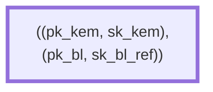
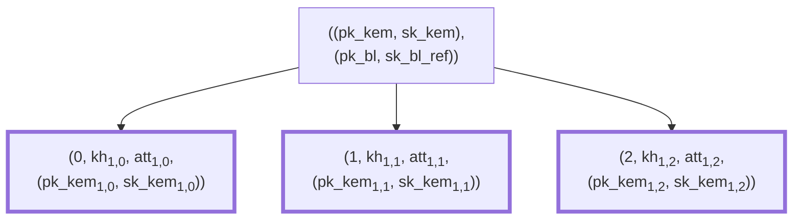
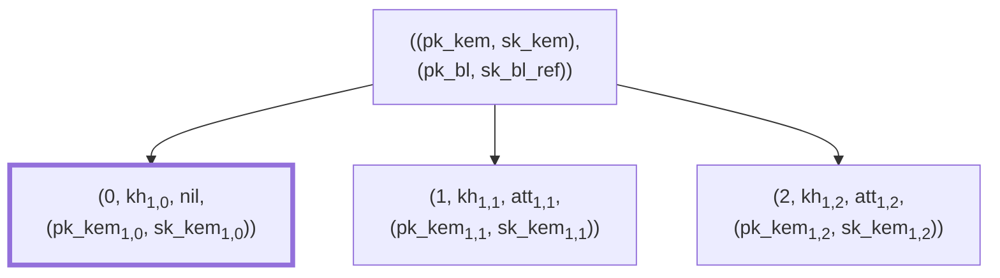
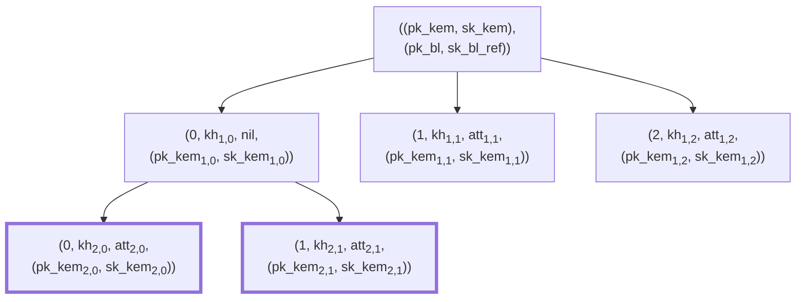

# Hierarchical Deterministic Keys

**Version:** 0.1.0-SNAPSHOT

**Authors:** Sander Dijkhuis (Cleverbase, editor)

**License:** [CC BY 4.0](https://creativecommons.org/licenses/by/4.0/)

## Introduction

See for context: [Privacy-preserving key management in the EU Digital Identity Wallet](context.md).

This document represents the consensus of the authors. It is not a standard.

## Conventions and definitions

The key words “MUST”, “MUST NOT”, “REQUIRED”, “SHALL”, “SHALL NOT”, “SHOULD”, “SHOULD NOT”, “RECOMMENDED”, “NOT RECOMMENDED”, “MAY”, and “OPTIONAL” in this document are to be interpreted as described in BCP 14 [[RFC2119]] [[RFC8174]] when, and only when, they appear in all capitals, as shown here.

The following notation is used throughout the document.

- byte: A sequence of eight bits.
- I2OS(x): Conversion of a nonnegative integer `x` to a byte array using a big-endian representation of the integer without padding.
- reduce(fn, list, init): Outputs the reduction of `list` to a single value by repeatedly applying the function `fn` to the list values and the current accumulation state, starting with `init`.

## Cryptographic dependencies

HDK depends on the following cryptographic constructs:

- Prime-Order Group;
- Cryptographic Hash Function;
- Asynchronous Remote Key Generation.

These are described in the following sections.

### Prime-order group

Let $B$ be the group generator of order $q$ of an elliptic curve $E$ defined over $GF(p)$. Denote scalar multiplication between a scalar $x$ and a point $A$ as $[x]A$.

This document uses types `Element` and `Scalar` to denote elements of $E$ and its set of scalars, respectively.

This document represents $E$ as the object `G`. The following member functions can be invoked on `G`.

- Order(): Outputs the order of $E$ (i.e. $p$).
- Identity(): Outputs the identity `Element` of $E$.
- Add(A, B): Outputs the sum of Elements `A` and `B`.
- SerializeScalar(s): Maps a Scalar `s` to a canonical byte array of fixed length `Ns`.
- ScalarMult(A, k): Outputs the scalar multiplication between Element `A` and Scalar `k`.
- ScalarBaseMult(k): Outputs the scalar multiplication between Scalar `k` and the group generator $B$.
- ECDH(k, A): Outputs the result of an Elliptic Curve Diffie-Hellman key exchange between Scalar `k` and Element `A`. The details vary based on the ciphersuite.

### Cryptographic hash function

This document represents a cryptographically secure hash function as `H`. This function maps arbitrary byte strings to Scalar elements associated with `G`. The details vary based on the ciphersuite.

### Asymmetric key blinding scheme

An asymmetric key blinding scheme `BL` provides the following functions:

- GenerateKeyPair(): Outputs a key pair `(pk, sk)`.
- BlindPublicKey(pk, tau): Outputs the deterministically blinded public key `pk_tau`.
- BlindSecretKey(sk, tau): Outputs the deterministically blinded secret key `sk_tau`.

It also defines the integer `L_bl`, which is the length of `tau` in bytes.

This document adds the following function:

- Combine(tau1, tau2): Outputs the combination of `tau1` and `tau2` such that `Blind*Key(x, Combine(tau1, tau2)) == Blind*Key(Blind*Key(x, tau1), tau2)` and `Combine(tau1, tau2) == Combine(tau2, tau1)`.

This document also defines the constant `Id_bl`, which is the identity blind such that `Combine(Id_bl, tau) == tau` for all `tau`.

### Key encapsulation mechanism

A key encapsulation mechanism `KEM` provides the following functions:

- GenerateKeyPair(): Outputs a key pair `(pk, sk)`.
- Encaps(pk): Outputs a key encapsulation `(k, c)` containing a shared secret `k` and an encapsulation ciphertext `c`.
- Decaps(sk, c): Outputs a shared secret `k` upon successful decapsulation, or an error otherwise.

### Asynchronous remote key generation

See [[draft-bradleylundberg-cfrg-arkg-01]]. This document assumes an `ARKG` instance with the following member functions:

- GenerateSeed(): Outputs an ARKG seed pair `(pk, sk)` at the delegating party, where `pk = (pk_kem, pk_bl)` and `sk = (sk_kem, sk_bl)`.
- DerivePublicKey(pk, info): Outputs `(pk', kh)` where `pk'` is a derived public key and `kh` is a key handle to derive the associated private key.

This document does not apply the DeriveSecretKey function directly, as it would require access to the original private key for scalar addition. Instead, this document applies an alternative function DeriveBlind:

```
ARKG-Derive-Blind(sk_kem, kh, info) -> tau
    ARKG instance parameters:
        BL        A key blinding scheme.
        KEM       A key encapsulation mechanism.
        MAC       A MAC scheme.
        KDF       A key derivation function.
        L_bl      The length in octets of the blinding factor tau
                    of the key blinding scheme BL.
        L_mac     The length in octets of the MAC key
                    of the MAC scheme MAC.

    Inputs:
        sk_kem    A key encapsulation secret key.
        kh        A key handle output from ARKG-Derive-Public-Key.
        info      An octet string containing optional context
                    and application specific information
                    (can be a zero-length string).

    Output:
        tau       A blind to apply to the secret key.

    The output sk' is calculated as follows:

    (c, tag) = kh
    k = KEM-Decaps(sk_kem, c)
    mk = KDF("arkg-mac" || 0x00 || info, k, L_mac)

    If MAC-Verify(mk, c || info, tag) = 0:
        Abort with an error.

    tau = KDF("arkg-blind" || 0x00 || info, k, L_bl)
```

Note that this is compatible with ARKG in the sense that:

```
BL-Blind-Secret-Key(sk_bl, ARKG.DeriveBlind(sk_kem, kh, info))
  == ARKG.DeriveSecretKey((sk_kem, sk_bl), kh, info)
```

### Proof of possession

A proof of possession protocol `PoP` provides the following functions:

- Sign(sk, info): Outputs `signature` using a secret key `sk` and application-specific `info`.
- Verify(proof, vk, info): Outputs whether `signature` is a valid proof of possession of the secret key associated with `vk`.

> [!NOTE]
> This is a generalization of signature schemes and Diffie Hellman-based schemes. In the case of signature schemes, `sk` is a private key and `vk` is a public key, and the `signature` is a digital signature. In the case of DH-based schemes, `sk == vk` is a shared secret, and the `signature` is a message authentication code (MAC) generated from a key derived from `sk`.

## Helper functions

### The BlindProve function

This document specifies several implementations of the BlindProve function, that creates a signature proving possession of a blinded secret key associated with a blinded public key.

```
Inputs:
- sk_bl, a blinding secret key.
- tau, a blind.
- info, a byte array of application-specific info.
- pk_rp, either a DH public key or empty.

Outputs:
- signature, a signature.
```

#### Using ECDH for BlindProve with multiplicative blinding

```
def BlindProve(sk_bl, tau, info, pk_rp):
  pk' = G.ScalarMult(pk_rp, tau)
  sk' = G.ECDH(sk_bl, pk')
  k = H(contextString || "prove" || sk')
  signature = MAC.Tag(k, info)
```

The G.ECDH computation MUST be performed in a WSCD.

#### Using threshold EC-SDSA for BlindProve with additive blinding

```
def BlindProve(sk_bl, tau, info, pk_rp):
  assert pk_rp == null
  (c,s) = ECSDSA.Sign(sk_bl, info)
  s' = s + c * tau (mod G.Order())
  signature = (c,s')
```

The ECSDSA.Sign computation MUST be performed in a WSCD.

#### Using threshold ECDSA for BlindProve with multiplicative blinding

Due to potential patent claims, this document does not specify an implementation for threshold ECDSA.

## Hierarchical Deterministic Keys

The following example illustrate the use of hierarchical deterministic keys.

**Level 0.** A wallet starts with a root node containing a key encapsulation key pair `(pk_kem, sk_kem)` and a secure cryptographic device-backed blinding public key and secret key reference `(pk_bl, sk_bl_ref)`:



**Level 1.** An initial (PID) attestation is based on trust in the root key, for example using a Wallet Instance Attestation. It results in several child nodes containing tuples `(j, kh, att, sk_kem)` of index `j`, key handle `kh`, attestation data `att`, and a newly generated key encapsulation key pair `(pk_kem, sk_kem)`:



When releasing attributes to a relying party, the wallet consumes an attestation, so its data may be removed from the tree. The key handle may need to be persisted in case the relying party will issue a new attestation based on it.



**Level 2.** When the relying party issues a new attestation, the related PoP key is derived from the presented key.



Note that while a tree representation is used, this is not a mandatory data structure. It could for example be flattened by combining blinds.

Note that key encapsulation key pairs are not reused across parent nodes in order to avoid linkability. Since they cannot be authenticated, they MAY be generated and stored outside of the WSCD. For example, they MAY be derived from attestation metadata using a secret key in the wallet.

### Key generation

The user generates `((pk_kem, pk_bl), (sk_kem, sk_bl)) = ARKG.GenerateSeed()` once in their WSCD.

### 5.2. Initial attestation issuance

Say the provider wants to issue `n` initial attestations.

Prerequisites:

- The provider trusts `pk_bl` to be protected by a secure cryptographic device. For example, the provider may rely on an EUDI Wallet Instance Attestation.
- The provider and the user agree on a ciphersuite identified by the byte array `contextString`.

Steps:

1. The provider shares challenge data including:
    - a nonce;
    - in the case of DH-based `PoP`, an ephemeral public key.
2. The user determines `sk` using the shared challenge data. That is, in the case of DH-based `PoP`, the user performs a DH exchange with `sk_bl`; otherwise, `sk == sk_bl`.
3. The user computes `signature = PoP.Sign(sk, info)` where `info` contains application-specific information including challenge data.
4. The user shares `proof` and `pk_kem` with the provider in an attestation issuance request.
5. The provider determines `vk` using `pk_bl` and, in the case of DH-based `PoP`, the ephemeral private key from step 1.
6. The provider verifies `PoP.Verify(signature, vk, info)`.
7. For each `j = 0, …, n-1`, the provider:
    1. Computes `info = contextString || "derive" || I2OS(j)`.
    2. Computes `(pk', kh) = ARKG.DerivePublicKey((pk_kem, pk_bl), info)`.
    3. Issues an attestation with `PoP` public key `pk'` and with `kh` as metadata that is not necessarily signed, but authenticated.
8. For each `j = 0, …, n-1`, the user stores `j`, `kh` and the attestation att<sub>1,j</sub>.

### 5.3. Proof of possession

Say the user has attributes at att<sub>i,j</sub> at level `i` with index `j` that are relevant to the relying party.

Prerequisites:

- The relying party trusts the provider of att<sub>i,j</sub>.
- The relying party and the user agree on a ciphersuite identified by the byte array `contextString`.
- The user knows indices `(j_1, ..., j_i)` and key handles `(kh_1, ..., kh_i)` and key encapsulation keys `(sk_kem_1, ..., sk_kem_(i-1))` leading to att<sub>i,j</sub>.

Steps:

1. The relying party shares challenge data including:
    - a nonce;
    - in the case of DH-based `PoP`, an ephemeral public key.
2. The user computes:
    - `tau(1) = ARKG.DeriveBlind(sk_kem, kh_1, contextString || "derive" || I2OS(j_1))`;
    - `tau(k+1) = ARKG.DeriveBlind(sk_kem_k, kh_{k+1}, contextString || "derive" || I2OS(j_{k+1}))` for each `k = 1, ..., i-1`;
    - `tau = reduce(BL.Combine, tau, Id_bl)`.
3. The user computes `signature = BlindProve(sk_bl, tau, info, pk_rp)` where `pk_rp` is the relying party’s ephemeral public key from step 1 in the case of DH-based `PoP`, and empty otherwise.
4. The user shares `signature` with the relying party in an attribute release.
5. The relying party determines `vk` using att<sub>i,j</sub> and, in the case of DH-based `PoP`, the ephemeral private key from step 1.
6. The relying party verifies `PoP.Verify(signature, vk, info)`.

Note that the performance of this algorithm scales linearly relative to the number of keys to derive. For short-lived one-time-use keys, the amount `n` is likely to be relatively small. For improved performance in case of large `n`, the result can be computed by caching intermediate values while computing `ARKG.DeriveBlind` or otherwise breaking down the implementation of `ARKG.DeriveBlind`.

### 5.4. Subsequent attestation issuance

Say the provider wants to issue `n` attestations to the user based on prior attribute release from att<sub>i,j</sub> (see previous section).

Prerequisites:

- The user has a blind `tau` such that `BL.BlindPublicKey(pk_bl, tau) == pk_pop` and `pk_pop` is attested in att<sub>i,j</sub> (see previous section).
- The provider trusts `pk_pop` to be associated with a sufficiently secured private key. For example, the provider may trust the att<sub>i,j</sub> provider to have verified this, or may assume security based on the application context.
- The provider and the user agree on a ciphersuite identified by the byte array `contextString`.

Steps:

1. The user shares `pk_kem` (pk_kem<sub>i,j</sub> associated with att<sub>i,j</sub>) with the provider in an attestation issuance request.
2. The provider, for each `j = 0, …, n-1`:
    1. Computes `info = contextString || "derive" || I2OS(j)`.
    2. Computes `(pk', kh) = ARKG.DerivePublicKey((pk_kem, pk_pop), info)`.
    3. Issues an attestation with `PoP` public key `pk'` and with `kh` as metadata that is not necessarily signed, but authenticated.
3. For each `j = 0, …, n-1`, the user stores `j`, `kh` and the attestation att<sub>i+1,j</sub>.

## 6. Ciphersuites

The RECOMMENDED ciphersuite is the one defined below.

### 6.1. HDK(ECDH, P-256, SHA-256, ARKG-P256mul-ECDH-P256-HMAC-SHA256-HKDF-SHA256))

The `contextString` value is `"HDK-ECDH-P256-SHA256-ARKG-P256mul-ECDH-P256-HMAC-SHA256-HKDF-SHA256-v1"`.

- `PoP`: Applying ECDH to establish a shared secret using the WSCD, and creating and verifying signatures as defined below.
- `BlindProve`: The ECDH implementation from Section 4.1.1.
- `G`: The NIST curve `secp256r1` (P-256), where `Ns = 32`.
    - ECDH(k, A): Implemented using `G.SerializeScalar(x)` where `x` is the $x$-coordinate of `G.ScalarMult(A, k)`.
    - SerializeScalar(s): Implemented using the Field-Element-to-Octet-String conversion.
- Hash `H(m)`: Implemented as `hash_to_field(msg=m, count=1)` from [[RFC9380]] using `expand_message_xmd` with SHA-256 with parameters `DST = contextString`, `F` set to the scalar field, `p` set to `G.Order()`, `m = 1`, and `L = 48`.
- `BL`: Elliptic curve arithmetic as described in [[draft-bradleylundberg-cfrg-arkg-01]] Section 3.1 but with multiplicative instead of additive blinding and the parameter:
    - `crv`: The NIST curve `secp256r1`.
- `KEM`: ECDH as described in [[draft-bradleylundberg-cfrg-arkg-01]] Section 3.2 with the parameter:
    - `crv`: The NIST curve `secp256r1`.
- `MAC`: HMAC as described in [[draft-bradleylundberg-cfrg-arkg-01]] Section 3.4 with the parameter:
    - `Hash`: SHA-256.
- `KDF`: HKDF as described in [[draft-bradleylundberg-cfrg-arkg-01]] Section 3.5 with the parameter:
    - `Hash`: SHA-256.
- `L_bl`: 32
- `L_mac`: 32

```
def Sign(sk, info):
  k = H(contextString || "prove" || sk)
  signature = MAC.Tag(k, info)

def Verify(signature, sk, info):
  k = H(contextString || "prove" || sk)
  signature' = MAC.Tag(k, info)
  check signature == signature'
```

## Security considerations

TODO

## References

## Normative references

<dl>

  <dt id=RFC2119>[RFC2119]<dd>

[RFC2119]: #RFC2119
Bradner, S., “Key words for use in RFCs to Indicate Requirement Levels”, BCP 14, [RFC 2119](https://www.rfc-editor.org/info/rfc2119), DOI 10.17487/RFC2119, March 1997.

  <dt id=RFC8174>[RFC8174]<dd>

[RFC8174]: #RFC8174
Leiba, B., “Ambiguity of Uppercase vs Lowercase in RFC 2119 Key Words”, BCP 14, [RFC 8174](https://www.rfc-editor.org/info/rfc8174), DOI 10.17487/RFC8174, May 2017.

  <dt id=RFC9380>[RFC9380]<dd>

[RFC9380]: #RFC9380
Faz-Hernandez, A., Scott, S., Sullivan, N., Wahby, R. S., and C. A. Wood, “Hashing to Elliptic Curves”, [RFC 9380](https://www.rfc-editor.org/info/rfc9380), DOI 10.17487/RFC9380, August 2023.

</dl>

## Informative references

<dl>

  <dt id=draft-bradleylundberg-cfrg-arkg-01>[draft-bradleylundberg-cfrg-arkg-01]<dd>

[draft-bradleylundberg-cfrg-arkg-01]: #draft-bradleylundberg-cfrg-arkg-01
Lundberg, E., and Bradley, J, “The Asynchronous Remote Key Generation (ARKG) algorithm
”, [draft-bradleylundberg-cfrg-arkg-01](https://www.ietf.org/archive/id/draft-bradleylundberg-cfrg-arkg-01.html), March 2024.

</dl>

## Acknowledgements

This design is based on ideas introduced to the EU Digital Identity domain by Peter Lee Altmann.
