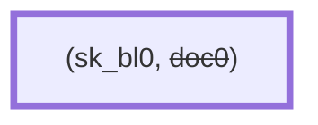
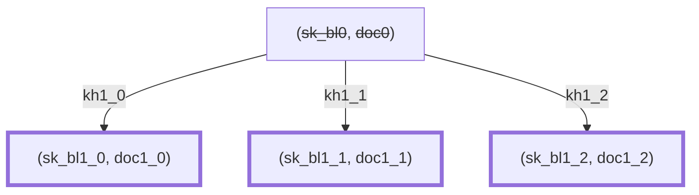
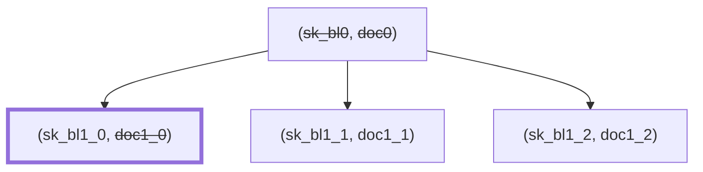
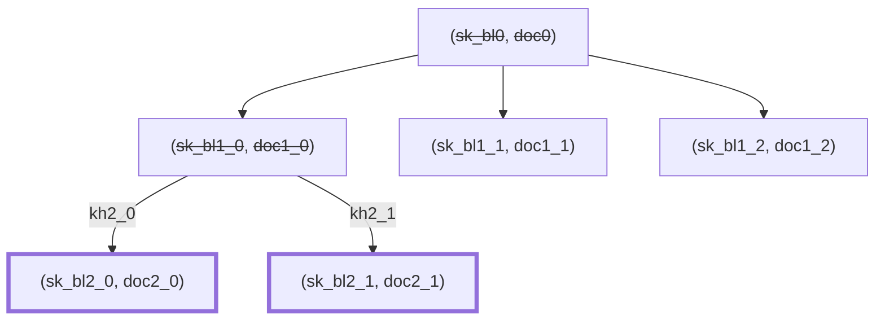

# Hierarchical Deterministic Keys

**Version:** 0.1.0-SNAPSHOT

**Authors:** Sander Dijkhuis (Cleverbase, editor)

**License:** [CC BY 4.0](https://creativecommons.org/licenses/by/4.0/)

## Introduction

See for context: [Privacy-preserving key management in the EU Digital Identity Wallet](context.md).

This document specifies the algorithms and protocols to apply Hierarchical Deterministic Keys (HDKs) for managing proof of possession keys and for issuing and releasing documents. It is designed to be applicable to profiles of [[ISO18013-5]], [[draft-OpenID4VP]], [[draft-OpenID4VCI]] and [[draft-ietf-oauth-selective-disclosure-jwt]].

With HDKs, it is feasible to manage many unique proof of possession keys in a digital identity wallet that is backed by a secure cryptographic device. Such devices often are not capable of the operations required to manage many related keys. This specification applies the Asynchronous Remote Key Generation algorithm [[draft-bradleylundberg-cfrg-arkg]] to this problem. For every issuance of a batch of reader-unlinkable documents, the user proves possession of a parent key applies ARKG with the issuer using ephemeral keys to efficiently create many child keys. The ARKG and blinded authentication algorithms can be executed within the general-purpose execution environment of the wallet solution, delegating only operations upon a single device key to the secure cryptographic device.

This is an alternative to Key Blinding for Signature Schemes [[draft-irtf-cfrg-signature-key-blinding]], which would require a secure cryptographic device that supports the BlindKeySign operation. These are not yet widely available at the time of writing.

This document provides a specification of the generic HDK scheme, generic HDK instances, and fully specified concrete HDK instances.

This document represents the consensus of the authors. It is not a standard.

### Conventions and definitions

The key words “MUST”, “MUST NOT”, “REQUIRED”, “SHALL”, “SHALL NOT”, “SHOULD”, “SHOULD NOT”, “RECOMMENDED”, “NOT RECOMMENDED”, “MAY”, and “OPTIONAL” in this document are to be interpreted as described in BCP 14 [[RFC2119]] [[RFC8174]] when, and only when, they appear in all capitals, as shown here.

The following notation is used throughout the document.

- byte: A sequence of eight bits.

## The Hierarchical Deterministic Keys scheme

An HDK instantiation applies key blinding in two ways:

- blinding a single private key in a secure cryptographic device with many blinding keys;
- blinding blinding keys to derive new blinding keys.

The following example illustrate the use of HDKs.

**Level 0.** The holder has a private key `sk_device` managed in a secure cryptographic device. The holder seeds their wallet with a random byte array. This results in a root tree node. The root tree node contains a blinding scalar `sk_bl0` which is deterministically derived from the random byte array. Additionally, the root tree node contains an attestation `doc0` which is generated by the wallet, containing:

- the public key `pk_bl` associated with `sk_device` blinded by `sk_bl0`, and
- optionally evidence of security of the blinded private key.


Now the holder wants to have an initial document from an issuer, such as an person identification document. The holder shares with the issuer `doc0` along with a proof of possession of `sk_device` blinded with `sk_bl0`, associated with public key `pk_bl`, and a newly generated key encapsulation key pair `(pk_kem, sk_kem)`. The initial issuer trusts the contents of `doc0`, for example based on wallet certification. After `doc0` is shared once, the holder may remove it.



**Level 1.** To achieve unlinkability at the reader’s side, the document will be represented as `n` one-time copies, in this example `n = 3`. Using key encapsulation, the issuer provides the holder with `n` documents `doc1_j` with associated unique proof of possession key pairs. The holder can compute the private keys by blinding `sk_device` with shared secret scalars `sk_bl1_j`. The issuer uses key encapsulation with `pk_bl` to share key handles `kh1_j` which contain the information to compute the scalars. After this process, the wallet may remove the original `sk_bl0`.



When releasing a document to a reader, the wallet includes a proof of possession generated using `sk_device` blinded with the associated blinding scalar, for example `sk_bl1_0`. After releasing the document, it may not be released a second time, so its data may be removed from the tree. The blinding scalar needs to be persisted during the session in case the reader will issue a new document based on it.



**Level 2.** When the reader issues a new document, the related proof of possession key may be derived from the presented key. In that case, the reader creates `m` one-time document copies, associated with `m` key handles `kh2_j` for key encapsulation. In this example, `m = 2`. After issuance, the wallet uses the key handles to compute associated blinding scalars `sk_bl2_j` so that the proof of possession keys can be computed using `sk_device` and `sk_bl2_j`. After this process, the wallet may remove the original `sk_bl1_0`.



Note that while a tree visualisation is used, HDK does not mandate this as a data structure or apply any tree structure properties in its algorithms.

Note that key encapsulation key pairs are not reused across parent nodes in order to avoid linkability. Since they cannot be authenticated, they MAY be generated and processed outside of the secure cryptographic device.

### Cryptographic dependencies

HDK depends on the following cryptographic constructs. The parameters of an HDK instance are:

- `ARKG`: An asynchronous remote key generation instance [[draft-bradleylundberg-cfrg-arkg]], encapsulating an asymmetric key blinding scheme instance `BL`, and consisting of the functions:
    - ARKG-Generate-Seed(): Outputs an ARKG seed pair `(pk, sk)` at the delegating party, where `pk = (pk_kem, pk_bl)` and `sk = (sk_kem, sk_bl)`, and where `(pk_bl, sk_bl)` is a `BL` key pair.
    - ARKG-Derive-Public-Key(pk, info): Outputs `(pk', kh)` where `pk'` is a derived public key and `kh` is a key handle to derive the associated private key.
    - ARKG-Derive-Private-Key(sk, kh, info): Outputs `sk'`, a blinded private key Scalar based on ARKG private seed `sk = (sk_kem, sk_bl)`, a key handle `kh`, and application-specific information `info`.
- `H`: A cryptographically secure hash, consisting of the function:
    - H1(message): Outputs a `BL` private key based on input `message`.

A concrete HDK instantiation MUST specify the instantiation of each of the above functions and values.

A concrete HDK instantiation MUST specify an instance identification string `contextString`.

A concrete HDK instantiation MUST have a parameter `sk_device`, which represents a root private key managed in the secure cryptographic device. Generation and management of this key is out of scope for the current spec.

### The HDK-Seed function

The holder seeds a new HDK tree by providing randomness. The generation of this randomness is out of scope for HDK.

```
Inputs:
- randomness, a byte array.

Outputs:
- sk_bl0, a key blinding private key.

def HDK-Seed(randomness):
    sk_bl0 = H1(randomness)
    Delete randomness.
    return sk_bl0
```

### The HDK-Public-Key function

The holder derives public keys from the device private key `sk_device`.

```
Parameters:
- sk_device, a device private key.

Inputs:
- sk_bl, a key blinding private key.

Outputs:
- pk, the public key associated with sk_device blinded with sk_bl.

def HDK-Public-Key(sk_bl)
```

### The HDK-Prove function

The holder proves possession of a key by blindly creating proof applying the device private key and the associated ARKG private key.

Note that the HDK scheme does not apply ARKG-Derive-Private-Key to the actual device private key as a key blinding private key. The reason is that may secure cryptographic devices do not support computation of ARKG-Derive-Private-Key for subsequent use in authentication. Instead, HDK applies ARKG-Derive-Private-Key to the tree node’s key blinding private key, and combines the output as a “blinding scalar” with `sk_device` in the function defined below.

```
Parameters:
- sk_device, a key blinding private key.

Inputs:
- sk_bl, a key blinding private key.
- pk_reader, a reader public key for a proof of possession.
- transcript, a session transcript.
- device_data, a byte array of application-specific device authentication data.

Outputs:
- proof, a proof of possession.

def HDK-Prove(sk_bl, pk_reader, transcript, device_data)
```

Implementations of this function typically perform pre-processing on the `challenge`, `transcript` and `info`, invoke the device key operation on the result, and perform post-processing on the result of that operation.

### Using deterministic blinding key generation

HDK applies [[draft-bradleylundberg-cfrg-arkg]] § 2.2.1 by defining:

```
Parameters:
- sk_device, the device private key.
- sk_bl, the parent key blinding private key.

Outputs:
- pk, a key blinding public key.
- sk, a key blinding private key.

def BL-Generate-Key-Pair():
    pk = HDK-Public-Key(sk_bl)
    sk = sk_bl
    return (pk, sk)
```

### Use cases

#### Seeding a new tree

1. **Holder** generates `randomness`.
2. **Holder** computes `sk_bl0 = HDK-Seed(randomness)`.
3. **Holder** computes `pk_bl = HDK-Public(sk_bl0)`.
4. **Holder** creates an initial attestation `doc0` containing `pk_bl`.
3. **Holder** stores `sk_bl0`.

The holder MAY seed multiple trees from a single `sk_device`.

#### Proof of possession

Summary: **Holder** proves possession of the blinded public key `pk_bl` in an attestation `doc` to **Reader**.

Prerequisites:

- **Holder** has an HDK instantiation identified by the byte array `contextString` with root key `sk_device`.
- **Reader** and **Holder** obtain some application-specific device authentication data `device_data`.
- **Reader** and **Holder** obtain some application-specific session transcript `transcript`. This is conditional; set `transcript = ""` otherwise.
- **Holder** knows a valid HDK tree node `(sk_bl, doc)` where `doc` contains `pk_bl`.

Steps:

1. **Reader** generates a reader key pair `(pk_reader, sk_reader)`. This step is conditional; set `pk_reader = ""` otherwise.
2. **Reader** shares `pk_reader` in a challenge with the holder.
3. **Holder** computes `proof = HDK-Prove(sk_blind, pk_reader, transcript, device_data)`.
4. **Holder** shares `proof` with the reader.
5. **Reader** verifies `proof`, optionally using `sk_reader`.

#### Attestation issuance

Summmary: **Reader** issues `n` attestations to **Holder**, each with a different public key for proof of possession.

Prerequisites:

- **Reader** and **Holder** agree on an HDK instantiation identified by the byte array `contextString` and **Holder** has associated root key `sk_device`.
- **Holder** knows a valid HDK tree node `(sk_bl, doc)`.

Define `dst = contextString || "derive"`.

Steps:

1. **Holder** computes `(pk, sk) = ARKG-Generate-Seed()` with parameters `(sk_device, sk_bl)`.
2. **Holder** shares `pk` with **Reader**.
3. **Reader**, `n` times:
    1. Computes `(pk', kh) = ARKG-Derive-Public-Key(pk, dst)`.
    2. Issues an attestation `doc` containing public key `pk'` for proof of possession.
    3. Shares `(doc, kh)` with **Holder**.
    4. Deletes `kh`.
4. **Holder**, for each `(doc, kh)` pair:
    1. Computes `sk' = ARKG-Derive-Private-Key(sk, kh, dst)`.
    2. Stores `(sk', doc)`.
5. **Holder** deletes `sk`.

In step 3.1, the reader MAY cache intermediate values of computing HDK-Derive-Public-Key as a performance optimization.

In step 3.3, the protocol application MUST ensure message integrity and sender authentication of `kh`.

In step 4.1, the holder MAY cache intermediate values of computing HDK-Derive-Private-Key as a performance optimization.

## Generic HDK instantiations

### Using ECDH message authentication codes for proof of possession

This method requires the following cryptographic constructs:

- `EC`: An elliptic curve with elements of type Element and scalars of type Scalar, consisting of the functions:
    - EC-Scalar-Mult(A, k): Outputs the scalar multiplication between Element `A` and Scalar `k`.
- `ECDH`: An Elliptic Curve Key Agreement Algorithm - Diffie-Hellman (ECKA-DH) [[TR03111]] with elliptic curve `EC`, consisting of the functions:
    - ECDH-Generate-Key-Pair(): Outputs a key pair `(pk, sk)`.
    - ECDH-Create-Shared-Secret(sk_self, pk_other): Outputs a shared secret byte string representing an Element.
- `H`: An extension with the function:
    - H2(message): Outputs a byte array.
- `MAC`: A function taking byte string inputs (salt, ikm, message) applying cryptographically secure hash functions to obtain a message authentication code combining `salt` with input keying material `ikm` and `message`.

The reader MUST create a new reader key pair using ECDH-Generate-Key-Pair for each challenge.

The reader MUST verify the proof using ECDH-Create-Shared-Secret.

The proof of possession parameters of HDK are instantiated as follows:

```
def HDK-Public-Key(sk_bl):
    Compute pk_device within the secure cryptographic device using sk_device.

    # Optionally implement using ECDH-Create-Shared-Secret.
    pk = EC-Scalar-Mult(sk_bl, pk_device)
    return pk

def HDK-Prove(sk_bl, pk_reader, transcript, device_data):
    # Optionally implement using ECDH-Create-Shared-Secret.
    P' = EC-Scalar-Mult(pk_reader, sk_bl)

    # Compute Z_AB within the secure cryptographic device.
    Z_AB = ECDH-Create-Shared-Secret(sk_device, P')

    salt = H2(transcript)
    proof = MAC(salt, Z_AB, device_data)
    return proof
```

The `ARKG` parameter of HDK is instantiated with multiplicative blinding.

### Using threshold EC-SDSA signatures for proof of possession

This method requires the following cryptographic constructs:

- `EC`: An elliptic curve with elements of type Element and scalars of type Scalar, consisting of the functions:
    - EC-Order(): Outputs the group order.
    - EC-Scalar-Mult(A, k): Outputs the scalar multiplication between Element `A` and Scalar `k`.
- `DSA`: an EC-SDSA (Schnorr) digital signature algorithm, consisting of the functions:
    - DSA-Sign(sk, message): Outputs the signature `(c, r)` created using private signing key `sk` over byte string `message`.
    - DSA-Verify(signature, pk, message): Outputs whether `signature` is a signature over `message` using public verification key `pk`.
    - DSA-Serialize(c, r): Outputs the byte array serialization of the signature `(c, r)`.
    - DSA-Deserialize(bytes): Outputs the signature `(c, r)` represented by byte string `bytes`.

The input keys of `DSA` MUST be the `ARKG` key blinding keys.

The reader MUST NOT create a reader key pair.

The reader MUST verify the proof using DSA-Verify.

```
def HDK-Public-Key(sk_bl):
    Compute pk_device within the secure cryptographic device using sk_device.

    # Optionally implement using ECDH-Create-Shared-Secret.
    pk = EC-Scalar-Mult(sk_bl, pk_device)
    return pk

def HDK-Prove(sk_bl, pk_reader, transcript, device_data):
    assert transcript == ""
    assert pk_reader == ""

    # Compute Z_AB within the secure cryptographic device.
    signature = DSA-Sign(sk_device, device_data)

    (c, s) = DSA-Deserialize(proof)
    s' = s + c * sk_blind mod EC-Order()
    proof = DSA-Serialize(c, s')
    return proof
```

### Using threshold ECDSA for multiplicative blind authentication

Due to potential patent claims and potential related-key attacks, this document does not specify an implementation for threshold ECDSA.

## Concrete HDK instantiations

The RECOMMENDED instantiation is the HDK-ECDH-P256. This provides better privacy to the holder because it does not produce a potentially non-repudiable signature over reader-provided data. Secure cryptographic devices that enable a high level of assurance typically support managing ECDH keys with the P-256 elliptic curve.

### HDK-ECDH-P256

The `contextString` value is `"HDK-ECDH-P256-v1"`.

- `ARKG`: ARKG instance as described in [[draft-bradleylundberg-cfrg-arkg]] with the identifier `ARKG-P256MUL-ECDH`, `KEM` as defined above, and `BL` with elliptic curve arithmetic as described in [[draft-bradleylundberg-cfrg-arkg]] Section 3.1 but with multiplicative instead of additive blinding.
- `EC`: The NIST curve `secp256r1` (P-256) [[SEC2]].
- `ECDH`: ECKA-DH with curve `G`
- `H`: SHA-256 [[FIPS180-4]] with:
    - `H1(message) = H(contextString || seed || message)`
    - `H2(message) = H(message)` for [[ISO18013-5]] compatibility
- `MAC` is defined below, applying the following cryptographic constructs:
    - `HKDF`: HKDF with `Hash` set to `H`
    - `HMAC`: HMAC with `H` set to `H`

```
def MAC(salt, ikm, message):
    prk = HKDF-Extract(salt, ikm)
    okm = HKDF-Expand(prk, "EMacKey", 32)
    mac = HMAC(okm, message)
```

The holder MUST generate `sk_device` as an `ECDH` private key in the secure cryptographic device.

## Security considerations

### Proofs of association

Cryptographically, the holder could provide a proof of association between two blinded public keys. For example, by creating a Schnorr non-interactive zero-knowledge proof of knowledge of a combination of the blinding scalars. This could assure the reader that two documents are issued to the same holder, and thereby potentially describe the same subject. However, this capability SHOULD be treated with caution since:

- This could produce a potentially non-repudiable proof that a certain combination of documents was revealed.
- The semantics of such a proof may be unclear to the reader and in case of disputes.

In general, use cases that require associated documents with a high level of assurance involve the processing of person identification data which can instead be used for claim-based holder and/or subject binding.

### Confidentiality of key handles

The key handles MUST be considered confidential, since they provide knowledge about the blinding factors. Compromise of this knowledge could introduce undesired linkability. In HDK, both the holder and the issuer know the key handle during issuance.

In an alternative to HDK, the holder independently generates blinded key pairs and proofs of association, providing the issuer with zero knowledge about the blinding factors. However, this moves the problem: the proofs of association would now need to be considered confidential.

## References

### Normative references

<dl>

  <dt id=FIPS180-4>[FIPS180-4]<dd>

[FIPS180-4]: #FIPS180-4
National Institute of Standards and Technology (NIST), “Secure Hash Standard (SHS)”, [FIPS 180-4](https://csrc.nist.gov/pubs/fips/180-4/upd1/final), DOI 10.6028/NIST.FIPS.180-4, June 2012.

  <dt id=ISO18013-5>[ISO18013-5]<dd>

[ISO18013-5]: #ISO18013-5
ISO/IEC, “Personal identification — ISO-compliant driving licence – Part 5: Mobile driving licence (mDL) application”, [ISO/IEC 18013-5:2021](https://www.iso.org/standard/69084.html), September 2019.

  <dt id=RFC2119>[RFC2119]<dd>

[RFC2119]: #RFC2119
Bradner, S., “Key words for use in RFCs to Indicate Requirement Levels”, BCP 14, [RFC 2119](https://www.rfc-editor.org/info/rfc2119), DOI 10.17487/RFC2119, March 1997.

  <dt id=RFC8017>[RFC8017]<dd>

[RFC8017]: #RFC8017
Moriarty, K., Ed., Kaliski, B., Jonsson, J., and A. Rusch, “PKCS #1: RSA Cryptography Specifications Version 2.2”, BCP 14, [RFC 8017](https://www.rfc-editor.org/info/rfc8017), DOI 10.17487/RFC8017, November 2016.

  <dt id=RFC8174>[RFC8174]<dd>

[RFC8174]: #RFC8174
Leiba, B., “Ambiguity of Uppercase vs Lowercase in RFC 2119 Key Words”, BCP 14, [RFC 8174](https://www.rfc-editor.org/info/rfc8174), DOI 10.17487/RFC8174, May 2017.

  <dt id=RFC9380>[RFC9380]<dd>

[RFC9380]: #RFC9380
Faz-Hernandez, A., Scott, S., Sullivan, N., Wahby, R. S., and C. A. Wood, “Hashing to Elliptic Curves”, [RFC 9380](https://www.rfc-editor.org/info/rfc9380), DOI 10.17487/RFC9380, August 2023.

<dt id=SEC2>[SEC2]<dd>

[SEC2]: #SEC2
Certicom Research, “SEC 2: Recommended Elliptic Curve Domain Parameters”, [Version 2.0](https://www.secg.org/sec2-v2.pdf), January 2010.

<dt id=TR03111>[TR03111]<dd>

[TR03111]: #TR03111
Federal Office for Information Security (BSI), “Elliptic Curve Cryptography”, [BSI TR-03111 Version 2.10](https://www.bsi.bund.de/EN/Themen/Unternehmen-und-Organisationen/Standards-und-Zertifizierung/Technische-Richtlinien/TR-nach-Thema-sortiert/tr03111/tr-03111.html), June 2018.

</dl>

### Informative references

<dl>

  <dt id=draft-bradleylundberg-cfrg-arkg>[draft-bradleylundberg-cfrg-arkg]<dd>

[draft-bradleylundberg-cfrg-arkg]: #draft-bradleylundberg-cfrg-arkg
Lundberg, E., and J. Bradley, “The Asynchronous Remote Key Generation (ARKG) algorithm”, [draft-bradleylundberg-cfrg-arkg-latest](https://yubico.github.io/arkg-rfc/draft-bradleylundberg-cfrg-arkg.html), 24 May 2024.

<dt id=draft-ietf-oauth-selective-disclosure-jwt>[draft-ietf-oauth-selective-disclosure-jwt]<dd>

[draft-ietf-oauth-selective-disclosure-jwt]: #draft-ietf-oauth-selective-disclosure-jwt
Fett, D., Yasuda, K., and B. Campbell, “Selective Disclosure for JWTs (SD-JWT)”, [draft-ietf-oauth-selective-disclosure-jwt-08](https://www.ietf.org/archive/id/draft-ietf-oauth-selective-disclosure-jwt-08.html), 4 March 2024.

<dt id=draft-irtf-cfrg-signature-key-blinding>[draft-irtf-cfrg-signature-key-blinding]<dd>

[draft-irtf-cfrg-signature-key-blinding]: #draft-irtf-cfrg-signature-key-blinding
Denis, F., Eaton, E., Lepoint, T., and C.A. Wood, “Key Blinding for Signature Schemes”, [draft-irtf-cfrg-signature-key-blinding-06](https://www.ietf.org/archive/id/draft-irtf-cfrg-signature-key-blinding-06.html#name-key-blinding), 1 April 2024.

<dt id=draft-OpenID4VCI>[draft-OpenID4VCI]<dd>

[draft-OpenID4VCI]: #draft-OpenID4VCI
Lodderstedt, T., Yasuda, K., and T. Looker, “OpenID for Verifiable Credential Issuance”, [draft 13](https://openid.net/specs/openid-4-verifiable-credential-issuance-1_0.html), 8 February 2024.

<dt id=draft-OpenID4VP>[draft-OpenID4VP]<dd>

[draft-OpenID4VP]: #draft-OpenID4VP
Terbu, O., Lodderstedt, T., Yasuda, K., and T. Looker, “OpenID for Verifiable Presentations”, [draft 20](https://openid.net/specs/openid-4-verifiable-presentations-1_0.html), 29 November 2023.

</dl>

## Acknowledgements

This design is based on ideas introduced to the EU Digital Identity domain by Peter Lee Altmann.
