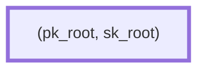
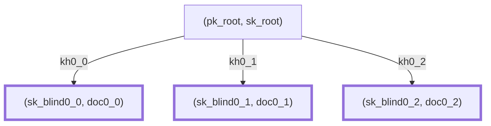
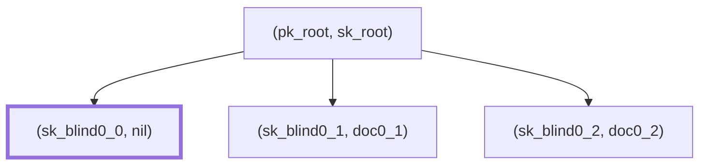
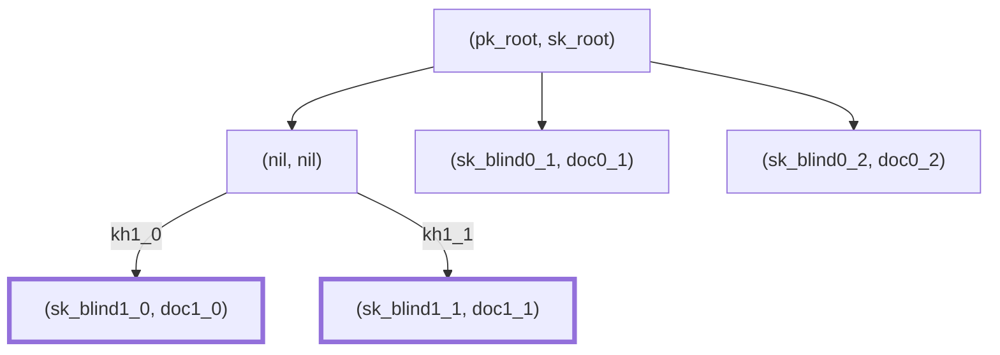

# Hierarchical Deterministic Keys

**Version:** 0.1.0-SNAPSHOT

**Authors:** Sander Dijkhuis (Cleverbase, editor)

**License:** [CC BY 4.0](https://creativecommons.org/licenses/by/4.0/)

## Introduction

See for context: [Privacy-preserving key management in the EU Digital Identity Wallet](context.md).

This document specifies the algorithms and protocols to apply Hierarchical Deterministic Keys (HDKs) for managing proof of possession keys and for issuing and releasing documents. It is designed to be applicable to profiles of [[ISO18013-5]], [[draft-OpenID4VP]], [[draft-OpenID4VCI]] and [[draft-ietf-oauth-selective-disclosure-jwt]].

With HDKs, it is feasible to manage many unique proof of possession keys in a digital identity wallet that is backed by a secure cryptographic device. Such devices often are not capable of the operations required to manage many related keys. This specification applies the Asynchronous Remote Key Generation algorithm [[draft-bradleylundberg-cfrg-arkg]] to this problem. For every issuance of a batch of reader-unlinkable documents, the user proves possession of a parent key applies ARKG with the issuer using ephemeral keys to efficiently create many child keys. The ARKG and blinded authentication algorithms can be executed within the general-purpose execution environment of the wallet solution, delegating only operations upon a single root key to the secure cryptographic device.

This is an alternative to Key Blinding for Signature Schemes [[draft-irtf-cfrg-signature-key-blinding]], which would require a secure cryptographic device that supports the BlindKeySign operation. These are not yet widely available at the time of writing.

This document provides a specification of the generic HDK scheme, generic HDK instances, and fully specified concrete HDK instances.

This document represents the consensus of the authors. It is not a standard.

### Conventions and definitions

The key words “MUST”, “MUST NOT”, “REQUIRED”, “SHALL”, “SHALL NOT”, “SHOULD”, “SHOULD NOT”, “RECOMMENDED”, “NOT RECOMMENDED”, “MAY”, and “OPTIONAL” in this document are to be interpreted as described in BCP 14 [[RFC2119]] [[RFC8174]] when, and only when, they appear in all capitals, as shown here.

The following notation is used throughout the document.

- byte: A sequence of eight bits.
- I2OSP(x, xLen): Conversion of a nonnegative integer `x` to a byte array of specified length `xLen` using a big-endian representation of the integer, as described in [[RFC8017]].

## The Hierarchical Deterministic Keys scheme

The following example illustrate the use of HDKs.

**Level 0.** The holder seeds their wallet with a root node containing a fresh blinding key pair `(pk_root, sk_root)` managed in a secure cryptographic device:



Now the holder wants to have an initial document, such as an person identification document. The holder shares with the issuer a proof of possession of `sk_root` and a newly generated key encapsulation key pair `(pk_kem, sk_kem)`. The issuer trusts `pk_root`, for example based on wallet trust evidence.

**Level 1.** To achieve unlinkability at the readers side, the document will be represented as `n` one-time copies, in this example `n = 3`. Using key encapsulation, the issuer provides the holder with `n` documents `doc0_j` with associated unique proof of possession key pairs. These key pairs are `(pk_root, sk_root)` blinded with shared secret scalars `sk_blind0_j`. The issuer uses key encapsulation with `pk_root` to share key handles `kh0_j` which contain the information to compute the scalars.



When releasing a document to a reader, the wallet includes a proof of possession generated using `sk_root` blinded with the associated blinding scalar, for example `sk_blind0_0`. After releasing the document, it may not be released a second time, so its data may be removed from the tree. The blinding scalar needs to be persisted during the session in case the reader will issue a new document based on it.



**Level 2.** When the reader issues a new document, the related proof of possession key may be derived from the presented key. In that case, the reader creates `m` one-time document copies, associated with `m` key handles `kh_j` for key encapsulation. In this example, `m = 2`. After issuance, the wallet uses the key handles to compute associated blinding scalars `sk_blind1_j` so that the proof of possession keys can be computed using `sk_root` and `sk_blind1_j`. After this process, the wallet may remove the original `sk_blind0_0`.



Note that while a tree visualisation is used, HDK does not mandate this as a data structure or apply any tree structure properties in its algorithms.

Note that key encapsulation key pairs are not reused across parent nodes in order to avoid linkability. Since they cannot be authenticated, they MAY be generated and processed outside of the secure cryptographic device.

### Cryptographic dependencies

HDK depends on the following cryptographic constructs. The parameters of an HDK instance are:

- `G`: An additive prime-order group with elements of type Element and scalars of type Scalar, consisting of the functions:
    - G-Order(): Outputs the group order.
    - G-Identity(): Outputs the identity Element of the group.
    - G-Identity-Scalar(): Outputs 0 if the group is used for additive blinding, 1 if the group if used for multiplicative blinding. Additive and multiplicative blinding will be explained in a later section.
    - G-Add(A, B): Outputs the sum of Elements `A` and `B`.
    - G-Serialize-Scalar(s): Maps a Scalar `s` to a canonical byte array of fixed length `Ns`.
    - G-Scalar-Mult(A, k): Outputs the scalar multiplication between Element `A` and Scalar `k`.
    - G-Scalar-Base-Mult(k): Outputs the scalar multiplication between Scalar `k` and the group generator.
- `KEM`: A key encapsulation mechanism [[draft-bradleylundberg-cfrg-arkg]], consisting of the functions:
    - KEM-Generate-Key-Pair(): Outputs a key pair `(pk, sk)`.
- `ARKG`: An asynchronous remote key generation instance [[draft-bradleylundberg-cfrg-arkg]], consisting of the functions:
    - ARKG-Generate-Seed(): Outputs an ARKG seed pair `(pk, sk)` at the delegating party, where `pk = (pk_kem, pk_bl)` and `sk = (sk_kem, sk_bl)`.
    - ARKG-Derive-Public-Key(pk, info): Outputs `(pk', kh)` where `pk'` is a derived public key and `kh` is a key handle to derive the associated private key.
    - ARKG-Derive-Private-Key(sk, kh, info): Outputs `sk'`, a blinded private key Scalar based on ARKG private seed `sk = (sk_kem, sk_bl)`, a key handle `kh`, and application-specific information `info`.
- `PoP`: A proof of possession authentication scheme, consisting of the functions:
    - PoP-Challenge(): Outputs `(challenge, state)` containing an opaque `challenge` and an opaque secret `state`.
    - PoP-Authenticate(sk, challenge, transcript, info): Outputs `proof` using a secret key `sk` with `challenge`, session transcript `transcript`, and application-specific `info`.
    - PoP-Verify(state, vk, challenge, transcript, info, proof): Outputs boolean `result` whether `proof` is a valid proof of possession of the secret key associated with verification key `vk` for `challenge`, `transcript` and `info`.

A concrete HDK instantiation MUST specify the instantiation of each of the above functions and values, as well as an instance identification string `contextString`.

The output keys keys of `KEM` MUST be the output keys of `ARKG`.

The input keys of `PoP` MUST be the output keys of `ARKG`.

The PoP-Authenticate function MUST be executed within a secure cryptographic device.

### The HDK-Blind-Authenticate function

The HDK scheme does not apply ARKG-Derive-Private-Key to the actual root key as a BL private key. The reason is that in HDK, the ARKG-Derive-Private-Key output cannot be computed within the secure cryptographic device for subsequent use in authentication. Instead, HDK applies ARKG-Derive-Private-Key to the G-Identity-Scalar as a BL private key, and uses the output as a “blinding scalar” in the function defined below.

```
Inputs:
- sk_root, a key blinding private key.
- sk_blind, a blinding scalar.
- challenge, a proof of possession challenge.
- transcript, a session transcript.
- info, a byte array of application-specific info.

Outputs:
- proof, a proof of possession.

def HDK-Blind-Authenticate(sk_root, sk_blind, challenge, transcript, info)
```

Implementations of this function typically perform pre-processing on the `challenge`, `transcript` and `info`, invoke PoP.Authenticate on the result with the root key, and perform post-processing on the `proof`.

### Use cases

#### Key generation

The holder generates `((pk_kem, pk_root), (sk_kem, sk_root)) = ARKG-Generate-Seed()` once in their secure cryptographic device.

#### Proof of possession

Summary: The holder proves possession of the blinded public key `pk_bl` in an attestation `att` to the reader.

Prerequisites:

- The reader trusts the reader of `att`.
- The reader and the holder agree on a ciphersuite identified by the byte array `contextString`.
- The reader and the holder have obtained some application-specific information `info_pop`. This is optional; the byte string may be empty.
- The holder has generated a root key pair `(pk_root, sk_root)` as described in the section “Key generation”.
- The holder knows the blinding scalar `sk_blind` associated with `pk_root` and `pk_bl`.

Note: If `pk_bl == pk_root`, then use `sk_blind == G-Identity-Scalar()`.

Steps:

1. The reader computes `(challenge, state) = PoP-Challenge()`.
2. The reader shares `challenge` with the holder.
3. The holder computes `transcript` in an application-specific way.
3. The holder computes `proof = HDK-Blind-Authenticate(sk_root, sk_blind, challenge, transcript, info_pop)`.
4. The holder shares `proof` with the reader.
4. The reader computes `transcript` in an application-specific way.
6. The reader verifies `PoP-Verify(state, pk_bl, challenge, transcript, proof, info_pop)`.

#### Attestation issuance

Summmary: The reader issues `n` attestations to the holder, each with a different `PoP` public key.

Prerequisites:

- The holder has generated a root key pair `(pk_root, sk_root)` as described in the section “Key generation”.
- The holder has proven possession of the private key associated with the public key `pk_bl` (see section above).
- The reader trusts `pk_bl` to be protected by a sufficiently secure cryptographic device. For example, the reader may rely on wallet trust evidence or on the presentation of an attestation bound to this key.
- The reader and the holder agree on a ciphersuite identified by the byte array `contextString`.
- The reader and the holder have obtained some application-specific information `info_pop`. This can for example be an empty byte string.
- The holder knows the blinding scalar `sk_blind` associated with `pk_root` and `pk_bl`.

Note: If `pk_bl == pk_root`, then use `sk_blind == G.IdentityScalar()`.

Steps:

1. The holder computes `(pk_kem, sk_kem) = KEM-Generate-Key-Pair()`.
2. For each `j = 0, …, n-1`, the reader:
    1. Computes `info_arkg = contextString || "derive" || I2OSP(j, 2)`.
    2. Computes `(pk', kh) = ARKG-Derive-Public-Key((pk_kem, pk_bl), info_arkg)`.
    3. Issues an attestation `att_j` with `PoP` public key `pk'`.
    4. Shares `att_j` and `kh` with the holder.
    5. Deletes `kh`.
3. For each `j = 0, …, n-1`, the holder:
    1. Computes `info_arkg = contextString || "derive" || I2OSP(j, 2)`.
    2. Computes `sk_blind_j = ARKG-Derive-Private-Key((sk_kem, sk_blind), kh, info_arkg)`.
    3. Stores `(sk_blind_j, att_j)`.

In step 2.2, the reader MAY cache intermediate values of computing ARKG-Derive-Public-Key as a performance optimization.

In step 2.4, the protocol application MUST ensure message integrity and sender authentication of `kh`.

In step 3.2, the holder MAY cache intermediate values of computing ARKG-Derive-Public-Key as a performance optimization.

## Generic HDK instantiations

### Using message authentication codes for proof of possession

This method requires the following cryptographic constructs:

- `ECDH`: An Elliptic Curve Key Agreement Algorithm - Diffie-Hellman (ECKA-DH) [[TR03111]], consisting of the functions:
    - ECDH-Generate-Key-Pair(): Outputs a key pair `(pk, sk)`.
    - ECDH-Create-Shared-Secret(sk_self, pk_other): Outputs a shared secret byte string representing an Element.
- `H`: A cryptographically secure hash function.
- `MAC`: A function taking byte string inputs (salt, ikm, message) applying cryptographically secure hash functions to obtain a message authentication code combining `salt` with input keying material `ikm` and `message`.

The `PoP` parameter of HDK is instantiated as follows:

```
def PoP-Challenge():
    (pk, sk) = ECDH-Generate-Key-Pair()
    challenge = pk
    state = sk

def PoP-Authenticate(sk, challenge, transcript, info):
    Z_AB = ECDH-Create-Shared-Secret(sk, challenge)
    salt = H(transcript)
    proof = MAC(salt, Z_AB, info)

def PoP-Verify(state, vk, challenge, transcript, info, proof):
    Z_AB = ECDH-Create-Shared-Secret(state, vk)
    salt = H(transcript)
    result = proof == MAC(salt, Z_AB, info)
```

The `ARKG` parameter of HDK is instantiated with multiplicative blinding.

The BlindAuthenticate function is defined as follows:

```
def HDK-Blind-Authenticate(sk_root, sk_blind, challenge, info):
    pk = G-Scalar-Mult(challenge, sk_blind)
    proof = PoP-Authenticate(sk_root, challenge, info)
```

> [!NOTE]
> The computation of `pk` may also be implemented using ECDH-Create-Shared-Secret.

### Using a digital signature algorithm for proof of possession

This method requires the following cryptographic constructs:

- `RNG`: a random number generator, consisting of the functions:
    - RNG-Generate-Nonce(): Outputs a nonce for replay detection.
- `DSA`: a digital signature algorithm, consisting of the functions:
    - DSA-Sign(sk, message): Outputs the signature `(s1, s2)` created using private key `sk` over byte string `message`.
    - DSA-Verify(signature, vk, message): Outputs whether `signature` is a signature over `message` using public key `vk`.
    - DSA-Serialize((s1, s2)): Outputs the byte array serialization of the signature `(s1, s2)`.
    - DSA-Deserialize(bytes): Outputs the signature `(s1, s2)` represented by byte string `bytes`.

The input keys of `DSA` MUST be the output keys of `ARKG`.

```
def PoP-Challenge():
    challenge = ""
    state = ""

def PoP-Authenticate(sk, challenge, transcript, info):
    assert challenge == ""
    signature = DSA-Sign(sk, info)
    proof = DSA-Serialize(signature)

def PoP-Verify(state, vk, challenge, transcript, proof, info):
    assert state == ""
    assert challenge == ""
    signature = DSA-Deserialize(proof)
    result = DSA-Verify(signature, vk, info)
```

#### Using threshold EC-SDSA for additive blind authentication

The BlindAuthenticate function is defined as follows:

```
def HDK-Blind-Authenticate(sk_root, sk_blind, challenge, info):
    proof = PoP-Authenticate(sk_root, challenge, info)
    (c, s) = DSA-Deserialize(proof)
    s' = s + c * sk_blind mod G.Order()
    proof = (c, s')
```

#### Using threshold ECDSA for multiplicative blind authentication

Due to potential patent claims, this document does not specify an implementation for threshold ECDSA.

## Concrete HDK instantiations

The RECOMMENDED instantiation is the HDK-ECDH-P256. This provides better privacy to the holder because it does not produce a potentially non-repudiable signature over reader-provided data. Secure cryptographic devices that enable a high level of assurance typically support managing ECDH keys with the P-256 elliptic curve.

### HDK-ECDH-P256

The `contextString` value is `"HDK-ECDH-P256-v1"`.

- `G`: The NIST curve `secp256r1` (P-256) [[SEC2]].
    - IdentityScalar(): 1.
- `KEM`: ECDH as described in [[draft-bradleylundberg-cfrg-arkg]] Section 3.3 with the parameters `crv` set to `G`, `Hash` set to SHA-256 [[FIPS180-4]], `DST_ext` set to `ARKG-P256ADD-ECDH`.
- `ARKG`: ARKG instance as described in [[draft-bradleylundberg-cfrg-arkg]] with the identifier `ARKG-P256MUL-ECDH`, `KEM` as defined above, and `BL` with elliptic curve arithmetic as described in [[draft-bradleylundberg-cfrg-arkg]] Section 3.1 but with multiplicative instead of additive blinding.
- `PoP`: Proof of possession instance as described in the section “Using message authentication codes for proof of possession”, with parameters:
    - `ECDH`: ECKA-DH with curve `G`
    - `H`: SHA-256 [[FIPS180-4]]
    - `MAC` is defined below, applying the following cryptographic constructs:
        - `HKDF`: HKDF with `Hash` set to `H`
        - `HMAC`: HMAC with `H` set to `H`

```
def MAC(salt, ikm, message):
    prk = HKDF-Extract(salt, ikm)
    okm = HKDF-Expand(prk, "EMacKey", 32)
    mac = HMAC(okm, message)
```

## Security considerations

### Proofs of association

Cryptographically, the holder could provide a proof of association between two blinded public keys. For example, by creating a Schnorr non-interactive zero-knowledge proof of knowledge of a combination of the blinding scalars. This could assure the reader that two documents are issued to the same holder, and thereby potentially describe the same subject. However, this capability SHOULD be treated with caution since:

- This could produce a potentially non-repudiable proof that a certain combination of documents was revealed.
- The semantics of such a proof may be unclear to the reader and in case of disputes.

In general, use cases that require associated documents with a high level of assurance involve the processing of person identification data which can instead be used for claim-based holder and/or subject binding.

### Confidentiality of key handles

The key handles MUST be considered confidential, since they provide knowledge about the blinding factors. Compromise of this knowledge could introduce undesired linkability. In HDK, both the holder and the issuer know the key handle during issuance.

In an alternative to HDK, the holder independently generates blinded key pairs and proofs of association, providing the issuer with zero knowledge about the blinding factors. However, this moves the problem: the proofs of association would now need to be considered confidential.

## References

### Normative references

<dl>

  <dt id=FIPS180-4>[FIPS180-4]<dd>

[FIPS180-4]: #FIPS180-4
National Institute of Standards and Technology (NIST), “Secure Hash Standard (SHS)”, [FIPS 180-4](https://csrc.nist.gov/pubs/fips/180-4/upd1/final), DOI 10.6028/NIST.FIPS.180-4, June 2012.

  <dt id=ISO18013-5>[ISO18013-5]<dd>

[ISO18013-5]: #ISO18013-5
ISO/IEC, “Personal identification — ISO-compliant driving licence – Part 5: Mobile driving licence (mDL) application”, [ISO/IEC 18013-5:2021](https://www.iso.org/standard/69084.html), September 2019.

  <dt id=RFC2119>[RFC2119]<dd>

[RFC2119]: #RFC2119
Bradner, S., “Key words for use in RFCs to Indicate Requirement Levels”, BCP 14, [RFC 2119](https://www.rfc-editor.org/info/rfc2119), DOI 10.17487/RFC2119, March 1997.

  <dt id=RFC8017>[RFC8017]<dd>

[RFC8017]: #RFC8017
Moriarty, K., Ed., Kaliski, B., Jonsson, J., and A. Rusch, “PKCS #1: RSA Cryptography Specifications Version 2.2”, BCP 14, [RFC 8017](https://www.rfc-editor.org/info/rfc8017), DOI 10.17487/RFC8017, November 2016.

  <dt id=RFC8174>[RFC8174]<dd>

[RFC8174]: #RFC8174
Leiba, B., “Ambiguity of Uppercase vs Lowercase in RFC 2119 Key Words”, BCP 14, [RFC 8174](https://www.rfc-editor.org/info/rfc8174), DOI 10.17487/RFC8174, May 2017.

  <dt id=RFC9380>[RFC9380]<dd>

[RFC9380]: #RFC9380
Faz-Hernandez, A., Scott, S., Sullivan, N., Wahby, R. S., and C. A. Wood, “Hashing to Elliptic Curves”, [RFC 9380](https://www.rfc-editor.org/info/rfc9380), DOI 10.17487/RFC9380, August 2023.

<dt id=SEC2>[SEC2]<dd>

[SEC2]: #SEC2
Certicom Research, “SEC 2: Recommended Elliptic Curve Domain Parameters”, [Version 2.0](https://www.secg.org/sec2-v2.pdf), January 2010.

<dt id=TR03111>[TR03111]<dd>

[TR03111]: #TR03111
Federal Office for Information Security (BSI), “Elliptic Curve Cryptography”, [BSI TR-03111 Version 2.10](https://www.bsi.bund.de/EN/Themen/Unternehmen-und-Organisationen/Standards-und-Zertifizierung/Technische-Richtlinien/TR-nach-Thema-sortiert/tr03111/tr-03111.html), June 2018.

</dl>

### Informative references

<dl>

  <dt id=draft-bradleylundberg-cfrg-arkg>[draft-bradleylundberg-cfrg-arkg]<dd>

[draft-bradleylundberg-cfrg-arkg]: #draft-bradleylundberg-cfrg-arkg
Lundberg, E., and J. Bradley, “The Asynchronous Remote Key Generation (ARKG) algorithm”, [draft-bradleylundberg-cfrg-arkg-latest](https://yubico.github.io/arkg-rfc/draft-bradleylundberg-cfrg-arkg.html), 24 May 2024.

<dt id=draft-ietf-oauth-selective-disclosure-jwt>[draft-ietf-oauth-selective-disclosure-jwt]<dd>

[draft-ietf-oauth-selective-disclosure-jwt]: #draft-ietf-oauth-selective-disclosure-jwt
Fett, D., Yasuda, K., and B. Campbell, “Selective Disclosure for JWTs (SD-JWT)”, [draft-ietf-oauth-selective-disclosure-jwt-08](https://www.ietf.org/archive/id/draft-ietf-oauth-selective-disclosure-jwt-08.html), 4 March 2024.

<dt id=draft-irtf-cfrg-signature-key-blinding>[draft-irtf-cfrg-signature-key-blinding]<dd>

[draft-irtf-cfrg-signature-key-blinding]: #draft-irtf-cfrg-signature-key-blinding
Denis, F., Eaton, E., Lepoint, T., and C.A. Wood, “Key Blinding for Signature Schemes”, [draft-irtf-cfrg-signature-key-blinding-06](https://www.ietf.org/archive/id/draft-irtf-cfrg-signature-key-blinding-06.html#name-key-blinding), 1 April 2024.

<dt id=draft-OpenID4VCI>[draft-OpenID4VCI]<dd>

[draft-OpenID4VCI]: #draft-OpenID4VCI
Lodderstedt, T., Yasuda, K., and T. Looker, “OpenID for Verifiable Credential Issuance”, [draft 13](https://openid.net/specs/openid-4-verifiable-credential-issuance-1_0.html), 8 February 2024.

<dt id=draft-OpenID4VP>[draft-OpenID4VP]<dd>

[draft-OpenID4VP]: #draft-OpenID4VP
Terbu, O., Lodderstedt, T., Yasuda, K., and T. Looker, “OpenID for Verifiable Presentations”, [draft 20](https://openid.net/specs/openid-4-verifiable-presentations-1_0.html), 29 November 2023.

</dl>

## Acknowledgements

This design is based on ideas introduced to the EU Digital Identity domain by Peter Lee Altmann.
