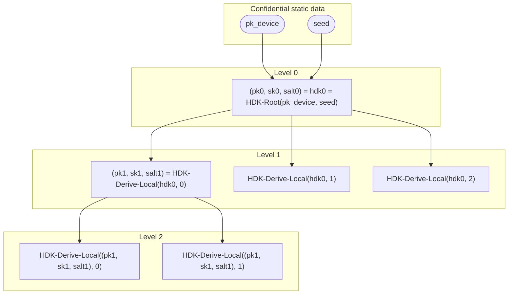
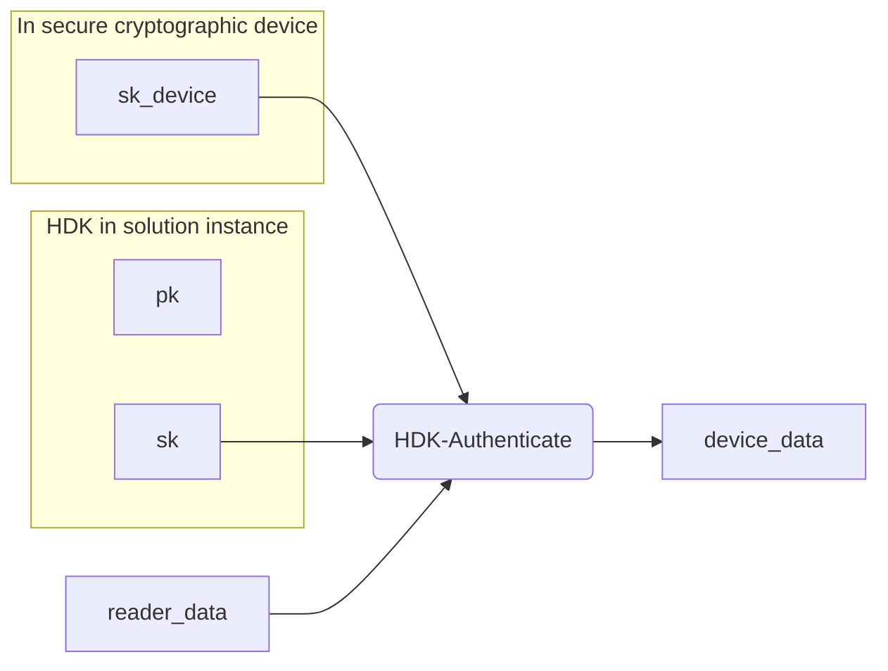

# Hierarchical Deterministic Keys

**Version:** 0.1.0-SNAPSHOT

**Authors:** Sander Dijkhuis (Cleverbase, editor)

**License:** [CC BY 4.0](https://creativecommons.org/licenses/by/4.0/)

## Introduction

This document specifies the algorithms to apply Hierarchical Deterministic Keys (HDKs). The purpose of an HDK architecture is to manage large sets of keys bound to a secure cryptographic device that protects a single key. This enables the development of secure digital identity wallets with unlinkability.

The core idea has been introduced in [[BIP32]] to create privacy-preserving cryptocurrency addresses. The present document extends the idea towards devices commonly used for digital wallets, and towards common interaction patterns for document issuance and authentication.

To store many HDKs, only a seed string needs to be securely stored, associated with the device private key. Each HDK is then deterministically defined by a path of self-generated indices or provided key handles. Such a path can efficiently be stored and requires less confidentiality than the seed.

To prove possession of many HDKs, the secure cryptographic device only needs to perform common cryptographic operations on a single key. The HDK acts as a blinding factor that enables blinding the device public key and device data upon authentication.

This document provides a specification of the generic HDK scheme, generic HDK instantiations, and fully specified concrete HDK instantiations.

An HDK instantiation is expected to be applied in a solution deployed as (wallet) solution instances. One solution instance can have multiple HDK instantiations, for example to manage multiple identities or multiple cryptographic algorithms or key protection mechanisms.

This document represents the consensus of the authors. It is not a standard.

### Conventions and definitions

The key words “MUST”, “MUST NOT”, “REQUIRED”, “SHALL”, “SHALL NOT”, “SHOULD”, “SHOULD NOT”, “RECOMMENDED”, “NOT RECOMMENDED”, “MAY”, and “OPTIONAL” in this document are to be interpreted as described in BCP 14 [[RFC2119]] [[RFC8174]] when, and only when, they appear in all capitals, as shown here.

The following notation is used throughout the document.

- byte: A sequence of eight bits.
- I2OSP(n, w): Convert non-negative integer `n` to a `w`-length, big-endian byte string, as described in [[RFC8017]].

## The Hierarchical Deterministic Keys algorithm

An HDK instantiation applies local key derivation to create many key pairs from a single seed value. It applies asynchronous remote key generation to enable providers to derive more key pairs. Additionally, an HDK instantiation applies these key pairs to blind a single key pair and proofs of its possession, such as required in [[RFC7800]].

### Introductory examples

#### Local key derivation example

The following example illustrates the use of key derivation. An HDK tree is defined by an initial public key and a seed value, which is a byte array containing sufficient entropy. Now tree nodes are constructed as follows.



The solution instance computes the Level 0 HDK at the root node using a deterministic function called HDK-Root. The HDK consists of a key pair `(pk0, sk0)`, and a byte string `salt0` to derive next-level keys.

The solution instance computes the Level `n > 0` value is using a deterministic function called HDK-Derive-Local. The function takes the previous-level salt as input, and a sequence number `i` starting at 0. The function returns a new HDK as output.

#### Remote key derivation example

Instead of a locally generated index, an HDK can also be derived using a key handle as per Asynchronous Remote Key Generation (ARKG) [[draft-bradleylundberg-cfrg-arkg]]. To enable ARKG, the solution instance uses HDK-Seed-Remote and provides the output public key to an issuer. The issuer returns a key handle, using which the solution instance can derive a next-level key pair and seed using HDK-Derive-Remote.

Locally derived parents can have remotely derived children. Remotely derived parents can have locally derived children.

#### Blinding example

The next concept to illustrate is blinding. Blinding enables a solution instance to prove possession of a private key without disclosing the directly associated public key. This way, solutions can avoid linkability across readers of a document that is released with proof of possession.

In this example, a document is issued in such a way that it can be presented with proof of possession using `pk` as derived using HDK. The solution instance applies the HDK-Authenticate function to the associated `sk` along with the device private key `sk_device` and reader-provided `reader_data`. The output is `device_data`, which the solution instance can subsequently use to prove possession to the reader. The reader does not need to be aware that HDK was used.



Blinding methods can be constructed such that the secure cryptographic device does not need to be designed for it. In such cases, `sk_device` does not contain the value of the private device key but a reference to it.

### Instantiation parameters

The parameters of an HDK instantiation are:

- `ID`: A domain separation tag, represented as a string of ASCII bytes.
- `Nk`: The amount of bytes needed to create a uniformly random key.
- `Ns`: The amount of bytes of a salt value with sufficient entropy.
- `key(bytes)`: Deterministically outputs a key pair `(pk, sk)` from a uniformly random string of `Nk` bytes.
- `serialize(pk)`: Serializes a public key `pk` to a fixed-size string.
- `expand(msg, DST, L)`: Outputs a uniformly random string of `L` bytes using a cryptographic hash or extendable-output function and input byte strings `msg` and `DST`.
- `BL`: An asymmetric key blinding scheme [[draft-bradleylundberg-cfrg-arkg]], consisting of the functions:
  - BL-Blind-Public-Key(pk, tau, info): Outputs `pk` blinded with blinding factor `tau` and domain separation parameter `info`, both byte strings.
  - BL-Blind-Private-Key(sk, tau, info): Outputs `sk` blinded with blinding factor `tau` and domain separation parameter `info`, both byte strings.
- `ARKG`: An asynchronous remote key generation instantiation [[draft-bradleylundberg-cfrg-arkg]], encapsulating an asymmetric key blinding scheme instantiation `BL` and a key encapsulation mechanism `KEM`, and consisting of the functions:
  - ARKG-Derive-Public-Key(pk, info): Outputs `(pk', kh)` where `pk'` is a derived public key and `kh` is a key handle to derive the associated private key, based on an ARKG public seed `pk = (pk_kem, pk_bl)` and application-specific information `info`.
  - ARKG-Derive-Private-Key(sk, kh, info): Outputs `sk'`, a blinded private key Scalar based on ARKG private seed `sk = (sk_kem, sk_bl)`, a key handle `kh`, and application-specific information `info`.
- `HDK-Root(pk_device, seed)`: See [The HDK-Root function](#the-hdk-root-function).
- `HDK-Derive-Remote(pk_device, (pk, sk, salt), kh)`: See [The HDK-Derive-Remote function](#the-hdk-derive-remote-function).
- `HDK-Authenticate(sk_device, sk_hdk, reader_data)`: See [The HDK-Authenticate function](#the-hdk-authenticate-function).

A concrete HDK instantiation MUST specify the instantiation of each of the above functions and values.

### The HDK-Root function

A solution instance creates a root HDK using a seed and a device public key. The generation of the seed is out of scope for this specification.

```
Inputs:
- pk_device, a device public key.
- seed, a string of Ns bytes.

Outputs:
- pk, the root public key.
- sk, the root private key.
- salt, the root salt.

def HDK-Root(pk_device, seed)
```

### The HDK-Derive-Local function

A solution instance derives a key pair and a salt from an HDK and an index.

```
Inputs:
- pk, a public key.
- sk, a private key.
- salt, a string of Ns bytes.
- index, an integer between 0 and 2^32-1 (inclusive).

Outputs:
- pk', the next-level public key at the provided index.
- sk', the next-level private key at the provided index.
- salt', the next-level salt at the provided index.

def HDK-Derive-Local((pk, sk, salt), index):
    msg = serialize(pk) || I2OSP(index, 4)
    okm = expand(msg, ID || salt, Nk + Ns)
    tau = okm[0:Nk]
    info = "HDK-Derive-Local"
    sk' = BL-Blind-Private-Key(sk, tau, info)
    pk' = BL-Blind-Public-Key(pk, tau, info)
    salt' = okm[Nk:]
    return (pk', sk', salt')
```

### The HDK-Seed-Remote function

A solution instance derives an ARKG seed from an HDK.

```
Inputs:
- pk, a public key.
- sk, a private key.
- salt, a string of Ns bytes.

Outputs:
- pk', an ARKG public seed.
- sk', an ARKG private seed.

def HDK-Seed-Remote((pk, sk, salt)):
    okm = expand("seed", ID || salt, Nk)
    (pk_kem, sk_kem) = key(okm)
    pk_bl = pk
    sk_bl = sk
    return ((pk_kem, pk_bl), (sk_kem, sk_bl))
```

Given an ARKG public seed `pk`, an issuer can derive an ARKG key handle `kh` and blinded public key `pk'` using:

```
(pk', kh) = ARKG-Derive-Public-Key(pk, "")
```

### The HDK-Derive-Remote function

A solution instance derives a key pair and a salt from an HDK and an ARKG key handle.

```
Inputs:
- pk_device, the device public key.
- pk, a public key.
- sk, a private key.
- salt, a string of Ns bytes.
- kh, an ARKG key handle.

Outputs:
- pk', the next-level public key for the provided key handle.
- sk', the next-level private key for the provided key handle.
- salt', the next-level salt for the provided key handle.

def HDK-Derive-Remote(pk_device, (pk, sk, salt), kh)
```

### The HDK-Authenticate function

A solution instance authenticates the device by blindly creating proof applying the device private key and an HDK private key. This yields device data which it can use to prove possession of the device-bound document. The application-specific data for proof of possession is out of scope for HDK.

```
Inputs:
- sk_device, a (reference to a) device private key.
- sk_hdk, an HDK private key.
- reader_data, a byte string of solution instance-specific reader data.

Outputs:
- device_data, a byte string of device data for proving possession.

def HDK-Authenticate(sk_device, sk_hdk, reader_data)
```

Implementations of this function typically perform pre-processing on the `reader_data`, invoke the device key operation on the result, and perform post-processing on the output.

A HDK instantiation MUST define HDK-Authenticate such that the `device_data` can be verified using the public key in the same HDK as `sk_hdk`. The reader does not need to know that HDK was applied: the public key will look like any other public key used for proofs of possession.

## Generic HDK instantiations

### Using elliptic curves

Instantiations of HDK using elliptic curves requires the following cryptographic construct:

- `EC`: An elliptic curve with elements of type Element and scalars of type Scalar, consisting of the functions:
  - EC-Add(A, B): Outputs the sum between Elements `A` and `B`.
  - EC-Scalar-Mult(A, k): Outputs the scalar multiplication between Element `A` and Scalar `k`.
  - EC-Scalar-Base-Mult(k): Outputs the scalar multiplication between the base Element and Scalar `k`.
  - EC-Order(): Outputs the order of the base Element.
  - EC-Serialize-Element(A): Outputs a byte string representing Element `A`.

These instantiations instantiate the following:

```
def serialize(pk):
    return EC-Serialize-Element(pk)

def key(bytes):
    sk' = OS2IP(bytes) mod (EC-Order() - 1)
    sk = sk' + 1
    pk = EC-Scalar-Base-Mult(sk)
    return (pk, sk)
```

### Using ECDH message authentication codes for proof of possession

Such instantiations of HDK use elliptic curves (see [Using elliptic curves](#using-elliptic-curves)) and require the following cryptographic construct:

- `ECDH`: An Elliptic Curve Key Agreement Algorithm - Diffie-Hellman (ECKA-DH) [[TR03111]] with elliptic curve `EC`, consisting of the functions:
  - ECDH-Create-Shared-Secret(sk_self, pk_other): Outputs a shared secret byte string representing an Element.

In such instantiations, the reader provides an ephemeral public key `reader_data`. The HDK-Authenticate function returns `device_data` consisting of a binary encoded x-coordinate `Z_AB` of an ECDH operation with `sk_device` and `sk_hdk`. Subsequently, the solution instance creates a message authentication code (MAC), such as in ECDH-MAC authentication defined in [[ISO18013-5]]. The reader verifies this MAC by performing an ECDH operation with its ephemeral private key and the HDK public key.

These instantiations instantiate the following:

```
def HDK-Root(pk_device, seed):
    msg = serialize(pk_device)
    okm = expand(msg, ID || seed, Nk + Ns)
    (_, sk') = key(okm[0:Nk])
    pk' = EC-Scalar-Mult(pk_device, sk')
    salt' = okm[Nk:]
    return (pk', sk', salt')

def HDK-Derive-Remote(pk_device, (pk, sk, salt), kh):
    (pk_arkg, sk_arkg) = HDK-Seed-Remote((pk, sk, salt))
    sk' = ARKG-Derive-Private-Key(sk_arkg, kh, "")
    pk' = EC-Scalar-Mult(pk_device, sk')
    msg = serialize(pk')
    salt' = expand(msg, ID || salt, Ns)
    return (pk', sk', salt')

def HDK-Authenticate(sk_device, sk_hdk, reader_data):
    P' = EC-Scalar-Mult(reader_data, sk_hdk)

    # Compute Z_AB within the secure cryptographic device.
    Z_AB = ECDH-Create-Shared-Secret(sk_device, P')

    return Z_AB
```

### Using EC-SDSA signatures for proof of possession

Such instantiations of HDK use elliptic curves (see [Using elliptic curves](#using-elliptic-curves)) require the following cryptographic construct:

- `DSA`: an EC-SDSA (Schnorr) digital signature algorithm [[TR03111]], consisting of the functions:
  - DSA-Sign(sk, message): Outputs the signature `(c, r)` created using private signing key `sk` over byte string `message`.
  - DSA-Verify(signature, pk, message): Outputs whether `signature` is a signature over `message` using public verification key `pk`.
  - DSA-Serialize(c, r): Outputs the byte array serialization of the signature `(c, r)`.
  - DSA-Deserialize(bytes): Outputs the signature `(c, r)` represented by byte string `bytes`.

The reader MUST create an input byte string `reader_data` with sufficient entropy for each challenge.

The reader MUST verify the proof `device_data` using DSA-Verify with the HDK public key.

```
def HDK-Root(pk_device, seed):
    msg = serialize(pk_device)
    okm = expand(msg, ID || seed, Nk + Ns)
    (_, sk') = key(okm[0:Nk])
    pk' = EC-Add(pk_device, EC-Scalar-Base-Mult(sk_blind))
    salt' = okm[Nk:]
    return (pk', sk', salt')

def HDK-Derive-Remote(pk_device, (pk, sk, salt), kh):
    (pk_arkg, sk_arkg) = HDK-Seed-Remote((pk, sk, salt))
    sk' = ARKG-Derive-Private-Key(sk_arkg, kh, "")
    pk' = EC-Add(pk_device, EC-Scalar-Base-Mult(sk'))
    msg = serialize(pk')
    salt' = expand(msg, ID || salt, Ns)
    return (pk', sk', salt')

def HDK-Authenticate(sk_device, sk_hdk, reader_data):
    # Compute signature within the secure cryptographic device.
    signature = DSA-Sign(sk_device, reader_data)

    (c, s) = DSA-Deserialize(proof)
    s' = s + c * sk_hdk mod EC-Order()
    proof = DSA-Serialize(c, s')
    return proof
```

### Using ECDSA signatures for proof of possession

Due to potential patent claims and potential related-key attacks, this document does not specify an implementation for threshold ECDSA.

## Concrete HDK instantiations

The RECOMMENDED instantiation is the HDK-ECDH-P256. This avoids the risk of having the holder unknowingly producing a potentially non-repudiable signature over reader-provided data. Secure cryptographic devices that enable a high level of assurance typically support managing ECDH keys with the P-256 elliptic curve.

### HDK-ECDH-P256

This instantiation uses ECDH (see [Using ECDH message authentication codes for proof of possession](#using-ecdh-message-authentication-codes-for-proof-of-possession)).

- `ID`: `"HDK-ECDH-P256-v1"`
- `Nr`: 48
- `Ns`: 32
- `expand`: `expand_message_xmd` from [[RFC9380]] with:
  - `H`: SHA-256 [[FIPS180-4]]
  - `b_in_bytes`: 32
  - `s_in_bytes`: 64
- `ARKG`: ARKG instantiation as described in [[draft-bradleylundberg-cfrg-arkg]] with the identifier `ARKG-P256MUL-ECDH`, `KEM` as defined above, and `BL` with elliptic curve arithmetic as described in [[draft-bradleylundberg-cfrg-arkg]] Section 3.1, but with multiplicative instead of additive blinding.
- `EC`: The NIST curve `secp256r1` (P-256) [[SEC2]].
- `ECDH`: ECKA-DH with curve `EC`

The holder MUST generate `sk_device` as an `ECDH` private key in the secure cryptographic device.

### HDK-ECSDSA-P256

This instantiation uses EC-SDSA (see [Using EC-SDSA signatures for proof of possession](#using-ec-sdsa-signatures-for-proof-of-possession)).

- `ID`: `"HDK-ECSDSA-P256-v1"`
- `Nr`: 48
- `Ns`: 32
- `expand`: `expand_message_xmd` from [[RFC9380]] with:
  - `H`: SHA-256 [[FIPS180-4]]
  - `b_in_bytes`: 32
  - `s_in_bytes`: 64
- `ARKG`: ARKG instantiation as described in [[draft-bradleylundberg-cfrg-arkg]] with the identifier `ARKG-P256ADD-ECDH`, `KEM` as defined above, and `BL` with elliptic curve arithmetic as described in [[draft-bradleylundberg-cfrg-arkg]] Section 3.1.
- `EC`: The NIST curve `secp256r1` (P-256) [[SEC2]].
- `DSA`: EC-SDSA-opt (the optimised EC-SDSA) with curve `EC`.

The holder MUST generate `sk_device` as a `DSA` private key in the secure cryptographic device.

## Application considerations

### Secure cryptographic device

The HDK algorithm assumes that the holder controls a secure cryptographic device that protects the device key pair `(pk_device, sk_device)`. The device key is under sole control of the holder.

In the context of [[EU2024-1183]], this device is typically called a Wallet Secure Cryptographic Device (WSCD), running a personalised Wallet Secure Cryptographic Application (WSCA) that exposes a Secure Cryptographic Interface (SCI) to a Wallet Instance (WI) running on a User Device (UD). The WSCD is certified to protect access to the device private key with high attack potential resistance to achieve high level of assurance authentication as per [[EU2015-1502]]. This typically means that the key is associated with a strong possession factor and with a rate-limited Personal Identification Number (PIN) check as a knowledge factor, and the verification of both factors actively involve the WSCD.

The HDK algorithm can support any of the following WSCD architectures:

1. Local external standalone device, for example:
   - GlobalPlatform secure element, running for example a Java Card applet as WSCA for:
     - Personal Identity Verification (PIV)
     - Fast IDentity Online 2 (FIDO2)
2. Local internal standalone programmable cryptographic chip, for example:
   - Smartphone embedded universal integrated circuit card (eUICC), running for example a Subscriber Identity Module (SIM) as WSCA; also called eSIM
   - Smartphone embedded secure element (eSE), running for example a Java Card applet as WSCA
3. Local internal preprogammed security platform, for example:
   - Android trusted execution environment acting as WSCA
   - Android StrongBox secure element acting as WSCA
   - iOS Secure Enclave system-on-chip acting as WSCA
   - Trusted Platform Module (TPM) acting as WSCA
4. Remote HSM, for example:
   - Cryptographic module certified against EN 419221-5:2018 with a local client application acting as WSCA, remotely controlled for example using:
     - PIV card as possession factor and PIN verification using a HSM-backed Device-Enhanced Augmented PAKE (an approach proposed by Sweden)
     - Android/iOS security platform or standalone device, applying asymmetric cryptography to enable detection of remote HSM corruption as described in [[SCAL3]]

In all cases, the WSCD may implement a Cryptographic Service Provider [[TR03181]] to reduce the scope for Common Criteria certification of the WSCA.

The solution proposal discussed herein works in all four WSCD architectures that support the required cryptographic primitives within the WSCD:

- In the case of HDK-ECDH-P256:
  - P-256 ECDH key pair generation
  - P-256 ECDH key agreement
- In the case of HDK-ECSDSA-P256:
  - P-256 EC-SDSA key pair generation
  - P-256 EC-SDSA signature creation

The other HDK operations can be performed in the WI running on any UD, including hostile ones with limited sandboxing capabilities, such as in a smartphone’s rich execution environment or in a personal computer web browser.

If the user enters the PIN in the WI instead of on the WSCD directly, the WI MUST process it directly after entering, the WI MUST keep the plaintext PIN confidential, and the WI MUST delete the PIN from memory as soon as the encrypted PIN or data derived from the PIN is passed over the SCI.

The rate-limiting of the PIN check MUST be managed within the WSCD or on securely managed SCI infrastructure. In particular, the rate-limiting MUST NOT be managed solely in local WI software since it is aassumed that attackers could modify this without detection.

### Trust evidence

Some issuers could require evidence from a solution provider of the security of the holder’s cryptographic device. This evidence is in the context of [[EU2024-1183]] divided into initial “Wallet Trust Evidence” and related “Issuer Trust Evidence”. Each is a protected document that contains a trust evidence public key associated with a private key that is protected in the secure cryptographic device. In HDK, these public keys are specified as follows.

#### Wallet Trust Evidence

The Wallet Trust Evidence public key is the root HDK public key. To achieve reader unlinkability, the wallet SHOULD limit access to a trusted person identification document provider only.

#### Issuer Trust Evidence

The Issuer Trust Evidence public key can be any non-root HDK public key. The solution provider MUST verify that the wallet knows the associated private key before issuing Issuer Trust Evidence. The solution provider MUST ensure that `sk_device` is under sole control of the solution instance holder. To achieve reader unlinkability, the solution instance MUST limit access of Issuer Trust Evidence to a single issuer. Subsequent issuers within the same HDK tree do not need to receive any Issuer Trust Evidence, since they can derive equally secure keys by applying ARKG to presented keys attested by trusted (other) issuers.

### Applying HDK in OpenID for Verifiable Credential Issuance

In [[draft-OpenID4VCI]], the following terminology applies:

| OpenID4VCI        | HDK               |
| ----------------- | ----------------- |
| Credential        | attestation       |
| Credential Issuer | issuer            |
| Verifier          | reader            |
| Wallet            | solution instance |

HDK enables solution instances and issuers cooperatively to establish the cryptographic key material that issued attestations will be bound to.

For asynchronous batch issuance, HDK proposes an update to the OpenID4VCI endpoints. This proposal is under discussion in [openid/OpenID4VCI#359](https://github.com/openid/OpenID4VCI/issues/359). In the update, the solution instance shares an ARKG public seed with the issuer, and the issuer shares a key handle for each attestation, generated using:

```
ARKG-Derive-Public-Key(key_generation_public_key, "")
```

## Security considerations

### Confidentiality of key handles

The key handles MUST be considered confidential, since they provide knowledge about the blinding factors. Compromise of this knowledge could introduce undesired linkability. In HDK, both the holder and the issuer know the key handle during issuance.

In an alternative to HDK, the holder independently generates blinded key pairs and proofs of association, providing the issuer with zero knowledge about the blinding factors. However, this moves the problem: the proofs of association would now need to be considered confidential.

## References

### Normative references

<dl>

  <dt id=draft-bradleylundberg-cfrg-arkg>[draft-bradleylundberg-cfrg-arkg]<dd>

[draft-bradleylundberg-cfrg-arkg]: #draft-bradleylundberg-cfrg-arkg

Lundberg, E., and J. Bradley, “The Asynchronous Remote Key Generation (ARKG) algorithm”, [draft-bradleylundberg-cfrg-arkg-latest](https://yubico.github.io/arkg-rfc/draft-bradleylundberg-cfrg-arkg.html), 24 May 2024.

  <dt id=FIPS180-4>[FIPS180-4]<dd>

[FIPS180-4]: #FIPS180-4

National Institute of Standards and Technology (NIST), “Secure Hash Standard (SHS)”, [FIPS 180-4](https://csrc.nist.gov/pubs/fips/180-4/upd1/final), DOI 10.6028/NIST.FIPS.180-4, June 2012.

  <dt id=ISO18013-5>[ISO18013-5]<dd>

[ISO18013-5]: #ISO18013-5

ISO/IEC, “Personal identification — ISO-compliant driving licence – Part 5: Mobile driving licence (mDL) application”, [ISO/IEC 18013-5:2021](https://www.iso.org/standard/69084.html), September 2019.

  <dt id=RFC2119>[RFC2119]<dd>

[RFC2119]: #RFC2119

Bradner, S., “Key words for use in RFCs to Indicate Requirement Levels”, BCP 14, [RFC 2119](https://www.rfc-editor.org/info/rfc2119), DOI 10.17487/RFC2119, March 1997.

  <dt id=RFC7800>[RFC7800]<dd>

[RFC7800]: #RFC7800

Jones, M., Bradley, J., and H. Tschofenig, “Proof-of-Possession Key Semantics for JSON Web Tokens (JWTs)”, [RFC 7800](https://www.rfc-editor.org/info/rfc7800), DOI 10.17487/RFC7800, April 2016.

  <dt id=RFC8017>[RFC8017]<dd>

[RFC8017]: #RFC8017

Moriarty, K., Ed., Kaliski, B., Jonsson, J., and A. Rusch, “PKCS #1: RSA Cryptography Specifications Version 2.2”, BCP 14, [RFC 8017](https://www.rfc-editor.org/info/rfc8017), DOI 10.17487/RFC8017, November 2016.

  <dt id=RFC8174>[RFC8174]<dd>

[RFC8174]: #RFC8174

Leiba, B., “Ambiguity of Uppercase vs Lowercase in RFC 2119 Key Words”, BCP 14, [RFC 8174](https://www.rfc-editor.org/info/rfc8174), DOI 10.17487/RFC8174, May 2017.

  <dt id=RFC9380>[RFC9380]<dd>

[RFC9380]: #RFC9380

Faz-Hernandez, A., Scott, S., Sullivan, N., Wahby, R. S., and C. A. Wood, “Hashing to Elliptic Curves”, [RFC 9380](https://www.rfc-editor.org/info/rfc9380), DOI 10.17487/RFC9380, August 2023.

<dt id=SEC2>[SEC2]<dd>

[SEC2]: #SEC2

Certicom Research, “SEC 2: Recommended Elliptic Curve Domain Parameters”, [Version 2.0](https://www.secg.org/sec2-v2.pdf), January 2010.

<dt id=TR03111>[TR03111]<dd>

[TR03111]: #TR03111

Federal Office for Information Security (BSI), “Elliptic Curve Cryptography”, [BSI TR-03111 Version 2.10](https://www.bsi.bund.de/EN/Themen/Unternehmen-und-Organisationen/Standards-und-Zertifizierung/Technische-Richtlinien/TR-nach-Thema-sortiert/tr03111/tr-03111.html), June 2018.

</dl>

### Informative references

<dl>

<dt id=BIP32>[BIP32]<dd>

[BIP32]: #BIP32

Wuille, P., “Hierarchical Deterministic Wallets”, [BIP32 version 2020-11-04](https://github.com/bitcoin/bips/blob/master/bip-0032.mediawiki), February 2012.

<dt id=draft-ietf-oauth-selective-disclosure-jwt>[draft-ietf-oauth-selective-disclosure-jwt]<dd>

[draft-ietf-oauth-selective-disclosure-jwt]: #draft-ietf-oauth-selective-disclosure-jwt

Fett, D., Yasuda, K., and B. Campbell, “Selective Disclosure for JWTs (SD-JWT)”, [draft-ietf-oauth-selective-disclosure-jwt-08](https://www.ietf.org/archive/id/draft-ietf-oauth-selective-disclosure-jwt-08.html), 4 March 2024.

<dt id=draft-irtf-cfrg-signature-key-blinding>[draft-irtf-cfrg-signature-key-blinding]<dd>

[draft-irtf-cfrg-signature-key-blinding]: #draft-irtf-cfrg-signature-key-blinding

Denis, F., Eaton, E., Lepoint, T., and C.A. Wood, “Key Blinding for Signature Schemes”, [draft-irtf-cfrg-signature-key-blinding-06](https://www.ietf.org/archive/id/draft-irtf-cfrg-signature-key-blinding-06.html#name-key-blinding), 1 April 2024.

<dt id=draft-OpenID4VCI>[draft-OpenID4VCI]<dd>

[draft-OpenID4VCI]: #draft-OpenID4VCI

Lodderstedt, T., Yasuda, K., and T. Looker, “OpenID for Verifiable Credential Issuance”, [draft 13](https://openid.net/specs/openid-4-verifiable-credential-issuance-1_0.html), 8 February 2024.

<dt id=draft-OpenID4VP>[draft-OpenID4VP]<dd>

[draft-OpenID4VP]: #draft-OpenID4VP

Terbu, O., Lodderstedt, T., Yasuda, K., and T. Looker, “OpenID for Verifiable Presentations”, [draft 20](https://openid.net/specs/openid-4-verifiable-presentations-1_0.html), 29 November 2023.

<dt id=EU2015-1502>[EU2015-1502]<dd>

[EU2015-1502]: #EU2015-1502

European Commission, “Commission Implementing Regulation (EU) 2015/1502 of 8 September 2015 on setting out minimum technical specifications and procedures for assurance levels for electronic identification means”, [(EU) 2015/1502](https://eur-lex.europa.eu/legal-content/TXT/?uri=CELEX%3A32015R1502), September 2015.

<dt id=EU2024-1183>[EU2024-1183]<dd>

[EU2024-1183]: #EU2024-1183

The European Parliament and the Council of the European Union, “Amending Regulation (EU) No 910/2014 as regards establishing the European Digital Identity Framework”, [(EU) 2024/1183](https://data.europa.eu/eli/reg/2024/1183/oj), April 2024.

<dt id=ePrint2021-963>[ePrint2021-963]<dd>

[ePrint2021-963]: #ePrint2021-963

Eaton, E., Stebila, D., and R. Stracovsky, “Post-Quantum Key-Blinding for Authentication in Anonymity Networks”, [Cryptology ePrint Archive, Paper 2021/963](https://eprint.iacr.org/2021/963), July 2021.

<dt id=SCAL3>[SCAL3]<dd>

[SCAL3]: #SCAL3

Cleverbase ID B.V., [“SCAL3: Verify that systems operate under your sole control”](https://github.com/cleverbase/scal3) version de8c5ae, March 2024.

<dt id=TR03181>[TR03181]<dd>

[TR03181]: #TR03181

Federal Office for Information Security (BSI), “Cryptographic Service Provider 2 (CSP2)”, [BSI TR-03181 Version 0.94](https://www.bsi.bund.de/EN/Themen/Unternehmen-und-Organisationen/Standards-und-Zertifizierung/Technische-Richtlinien/TR-nach-Thema-sortiert/tr03181/TR-03181_node.html), April 2023.

</dl>

## Acknowledgements

This design is based on ideas introduced to the EU Digital Identity domain by Peter Lee Altmann.

Helpful feedback came from Emil Lundberg and Remco Schaar.
