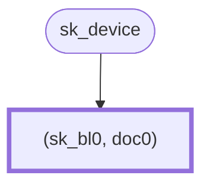

# Hierarchical Deterministic Keys

**Version:** 0.1.0-SNAPSHOT

**Authors:** Sander Dijkhuis (Cleverbase, editor)

**License:** [CC BY 4.0](https://creativecommons.org/licenses/by/4.0/)

## Introduction

See for context: [Privacy-preserving key management in the EU Digital Identity Wallet](context.md).

This document specifies the algorithms and protocols to apply Hierarchical Deterministic Keys (HDKs) for managing proof of possession keys and for issuing and releasing documents. It is designed to be applicable to profiles of [[ISO18013-5]], [[draft-OpenID4VP]], [[draft-OpenID4VCI]] and [[draft-ietf-oauth-selective-disclosure-jwt]].

Security and privacy objectives are:

- **Parent-Binding**: Enable a issuer to issue an attestation that includes a public proof of possession [[RFC7800]] key with the corresponding private key being secured in the same device as the one that secures the key material included in the document used during authentication to the issuer. When used with a device key pair that is protected against key extraction, this objective achieves what is in some literature called “Unforgeability” and “Non-Transferability”.
- **Reader-Unlinkability**: Readers cannot use the proof of possession key to determine if an attribute presentation belongs to the same identity subject as a previous attribute presentation. In practice, with today’s supported cryptography, this implies that each issued attestation includes a unique one-time-use proof of possession key, which prevents correlation across presentations. This objective is in some literature called “Unlinkability with respect to Relying Parties”.
- **Weak-Issuer-Unlinkability**: Potentially colluding issuers cannot determine if an attestation issued by one issuer describes the same identity subject as another attestation issued by another issuer on the basis of any proof of possession key (i.e., both the key the issuer saw when authenticating the holder, and the key the issuer includes in the issued attestation). This objective is in some literature called “Unlinkability with respect to Identity Providers” or “Unobservability”.
- **Plausible-Deniability**: Readers cannot prove to others that the holder presented certain attributes. In practice, with today’s supported cryptography, this implies the use of symmetric cryptography between the holder and the reader.
- **Issuer-Unforgeability**: Issuers cannot use another issuer’s document presentation to forge a new presentation. This objective is in some literature [[ePrint2021-963]] called “existential unforgeability under chosen message and epoch attack” or EUF-CMEA.

The following are not security and privacy objectives for HDK:

- **Strong-Issuer-Unlinkability**: HDK does not protect against an issuer correlating attribute presentations to a single identity subject. HDK assumes the use of qualified electronic seals, which in practice with today’s supported cryptography cannot be blinded afterwards for presentation. Therefore, an issuer could use the seal as a trace identifier. This objective is in some literature called “Unlinkability with respect to Identity Providers and Relying Parties” or “Untraceability”.

The following security and privacy objectives are not in scope for HDK, but could be achieved in a scheme that includes HDK:

- **Selective-Disclosure**: Holders can decide what information to disclose to readers, for example by applying [[ISO18013-5]] or [[draft-ietf-oauth-selective-disclosure-jwt]].
- **Pseudonymous-Authentication**: Holders can securely authenticate towards different readers with different pseudonymous idnetifiers. This is not an objective of HDK itself, but HDK can be combined with other schemes to achieve this objective.
- **Unconditional-Privacy**: Even when given a powerful quantum computer or unlimited computing power, attackers could not break the scheme’s privacy objectives. As long as no proof of association between keys is given, this holds for the listed privacy objectives. This objective is in some literature called “Everlasting Privacy”.

With HDKs, it is feasible to manage many unique proof of possession keys in a digital identity wallet that is backed by a secure cryptographic device. See the section [Secure cryptographic device](#secure-cryptographic-device) for details. Such devices often are not capable of the operations required to manage many related keys. This specification applies the Asynchronous Remote Key Generation algorithm [[draft-bradleylundberg-cfrg-arkg]] to this problem. For every issuance of a batch of reader-unlinkable documents, the user proves possession of a parent key applies ARKG with the issuer using ephemeral keys to efficiently create many child keys. The ARKG and blinded authentication algorithms can be executed within the general-purpose execution environment of the wallet solution, delegating only operations upon a single device key to the secure cryptographic device.

This is an alternative to Key Blinding for Signature Schemes [[draft-irtf-cfrg-signature-key-blinding]], which would require a secure cryptographic device that supports the BlindKeySign operation. These are not yet widely available at the time of writing.

This document provides a specification of the generic HDK scheme, generic HDK instances, and fully specified concrete HDK instances.

This document represents the consensus of the authors. It is not a standard.

### Conventions and definitions

The key words “MUST”, “MUST NOT”, “REQUIRED”, “SHALL”, “SHALL NOT”, “SHOULD”, “SHOULD NOT”, “RECOMMENDED”, “NOT RECOMMENDED”, “MAY”, and “OPTIONAL” in this document are to be interpreted as described in BCP 14 [[RFC2119]] [[RFC8174]] when, and only when, they appear in all capitals, as shown here.

The following notation is used throughout the document.

- byte: A sequence of eight bits.

## The Hierarchical Deterministic Keys scheme

An HDK instantiation applies key blinding in two ways:

- blinding a single private key in a secure cryptographic device with many blinding keys;
- blinding blinding keys to derive new blinding keys.

The following example illustrate the use of HDKs.

**Level 0.** The wallet holder has a private key `sk_device` managed in a secure cryptographic device. The wallet provider seeds their wallet with a random byte array. This results in a root tree node. The root tree node contains a blinding scalar `sk_bl0` which is deterministically derived from the random byte array. Additionally, the wallet provider issues an attestation `doc0` associated to the root tree node, containing:

- the public key `pk_bl0` associated with `sk_device` blinded by `sk_bl0`, and
- evidence of security of the blinded private key (see [Trust evidence](#trust-evidence)).



Now the holder wants to have an initial document from a third party issuer, such as an person identification document. The holder shares with the issuer `doc0` along with a proof of possession of `sk_device` blinded with `sk_bl0`, associated with public key `pk_bl0`, and a newly generated key encapsulation key pair `(pk_kem, sk_kem)`. The initial issuer trusts the contents of `doc0`, for example based on wallet certification. After `doc0` is shared once, the holder may remove it.


**Level 1.** To achieve unlinkability at the reader’s side, the document will be represented as `n` one-time copies, in this example `n = 3`. Using key encapsulation, the issuer provides the holder with `n` documents `doc1_j` with associated unique proof of possession key pairs. The holder can compute the private keys by blinding `sk_device` with shared secret scalars `sk_bl1_j`. The issuer uses key encapsulation with `pk_bl` to share key handles `kh1_j` which contain the information to compute the scalars. After this process, the wallet may remove the original `sk_bl0`.


When releasing a document to a reader, the wallet includes a proof of possession generated using `sk_device` blinded with the associated blinding scalar, for example `sk_bl1_0`. After releasing the document, it may not be released a second time, so its data may be removed from the tree. The blinding scalar needs to be persisted during the session in case the reader will issue a new document based on it.


**Level 2.** When the reader issues a new document, the related proof of possession key may be derived from the presented key. In that case, the reader creates `m` one-time document copies, associated with `m` key handles `kh2_j` for key encapsulation. In this example, `m = 2`. After issuance, the wallet uses the key handles to compute associated blinding scalars `sk_bl2_j` so that the proof of possession keys can be computed using `sk_device` and `sk_bl2_j`. After this process, the wallet may remove the original `sk_bl1_0`.


Note that while a tree visualisation is used, HDK does not mandate this as a data structure or apply any tree structure properties in its algorithms.

Note that key encapsulation key pairs are not reused across parent nodes in order to avoid linkability. Since they cannot be authenticated, they MAY be generated and processed outside of the secure cryptographic device.

Note that issuers may include the wallet provider, for example for a wallet instance attestation or issuer trust evidence. Issuers may also include the wallet user, for example for a self-issued identity. In both cases, the attestation nodes branch off of a root tree node.

### Cryptographic dependencies

HDK depends on the following cryptographic constructs. The parameters of an HDK instance are:

- `ARKG`: An asynchronous remote key generation instance [[draft-bradleylundberg-cfrg-arkg]], encapsulating an asymmetric key blinding scheme instance `BL`, and consisting of the functions:
  - ARKG-Generate-Seed(): Outputs an ARKG seed pair `(pk, sk)` at the delegating party, where `pk = (pk_kem, pk_bl)` and `sk = (sk_kem, sk_bl)`, and where `(pk_bl, sk_bl)` is a `BL` key pair.
  - ARKG-Derive-Public-Key(pk, info): Outputs `(pk', kh)` where `pk'` is a derived public key and `kh` is a key handle to derive the associated private key.
  - ARKG-Derive-Private-Key(sk, kh, info): Outputs `sk'`, a blinded private key Scalar based on ARKG private seed `sk = (sk_kem, sk_bl)`, a key handle `kh`, and application-specific information `info`.
- `H`: A cryptographically secure hash, consisting of the function:
  - H1(message): Outputs a `BL` private key based on input `message`.

A concrete HDK instantiation MUST specify the instantiation of each of the above functions and values.

A concrete HDK instantiation MUST specify an instance identification string `contextString`.

A concrete HDK instantiation MUST have a parameter `sk_device`, which represents a root private key managed in the secure cryptographic device. Generation and management of this key is out of scope for the current spec.

### The HDK-Seed function

The provider seeds a new HDK tree by providing randomness. The generation of this randomness is out of scope for HDK.

```
Inputs:
- randomness, a byte array.

Outputs:
- sk_bl0, a key blinding private key.

def HDK-Seed(randomness):
    sk_bl0 = H1(randomness)
    Delete randomness.
    return sk_bl0
```

### The HDK-Public-Key function

The holder derives public keys from the device private key `sk_device`.

```
Parameters:
- sk_device, a device private key.

Inputs:
- sk_bl, a key blinding private key.

Outputs:
- pk, the public key associated with sk_device blinded with sk_bl.

def HDK-Public-Key(sk_bl)
```

### The HDK-Authenticate function

The holder proves possession of a key by blindly creating proof applying the device private key and the associated ARKG private key. The HDK-Authenticate function creates the authentication data using which the holder can do this. The application-specific data for proof of possession is out of scope for HDK.

Note that the HDK scheme does not apply ARKG-Derive-Private-Key to the actual device private key as a key blinding private key. The reason is that may secure cryptographic devices do not support computation of ARKG-Derive-Private-Key for subsequent use in authentication. Instead, HDK applies ARKG-Derive-Private-Key to the tree node’s key blinding private key, and combines the output as a “blinding scalar” with `sk_device` in the function defined below.

```
Parameters:
- sk_device, a key blinding private key.

Inputs:
- sk_bl, a key blinding private key.
- reader_data, a byte array of application-specific reader data.

Outputs:
- device_data, device data for creating a proof of possession.

def HDK-Authenticate(sk_bl, input)
```

Implementations of this function typically perform pre-processing on the `reader_data`, invoke the device key operation on the result, and perform post-processing on the output.

A HDK instantiation MUST define HDK-Authenticate such that the `device_data` can be verified using the HDK-Public-Key generated with the same `sk_bl`.

Examples:

- ECDH with `reader_data` being a public key and `device_data` consisting of a binary encoded x-coordinate of an ECDH operation with `sk_device` and `sk_bl`.
- DSA with `reader_data` containing a nonce and `device_data` consisting of a digital signature created using `sk_device` and `sk_bl`.

### Using deterministic blinding key generation

HDK applies [[draft-bradleylundberg-cfrg-arkg]] § 2.2.1 by defining:

```
Parameters:
- sk_bl, the parent key blinding private key.

Outputs:
- pk, a key blinding public key.
- sk, a key blinding private key.

def BL-Generate-Key-Pair():
    pk = HDK-Public-Key(sk_bl)
    sk = sk_bl
    return (pk, sk)
```

### Use cases

#### Seeding a new tree

1. **Holder** proves possession of `sk_device` to **Provider**.
2. **Provider** generates `randomness`.
3. **Provider** computes `sk_bl0 = HDK-Seed(randomness)`.
4. **Provider** computes `pk_bl0 = HDK-Public(sk_bl0)`.
5. **Provider** issues an initial attestation `doc0` containing `pk_bl0`.
6. **Holder** stores `sk_bl0` with `doc0`.

The provider MUST NOT seed multiple trees from a single `sk_device`.

#### Proof of possession

Summary: **Holder** proves possession of the blinded public key `pk_bl` in an attestation `doc` to **Reader**.

Prerequisites:

- **Holder** has an HDK instantiation identified by the byte array `contextString` with root key `sk_device`.
- **Reader** and **Holder** obtain some application-specific `reader_data`, possibly an empty string.
- **Holder** knows a valid HDK tree node `(sk_bl, doc)` where `doc` contains `pk_bl`.

Steps:

1. **Holder** computes `device_data = HDK-Authenticate(sk_blind, pk_reader)`.
2. **Holder** creates a proof of possession using `device_data`.
3. **Holder** shares the proof with the reader.
4. **Reader** verifies the proof.

#### Attestation issuance

Summmary: **Reader** issues `n` attestations to **Holder**, each with a different public key for proof of possession.

Prerequisites:

- **Reader** and **Holder** agree on an HDK instantiation identified by the byte array `contextString` and **Holder** has associated root key `sk_device`.
- **Holder** knows a valid HDK tree node `(sk_bl, doc)`.

Define `dst = contextString || "derive"`.

Steps:

1. **Holder** computes `(pk, sk) = ARKG-Generate-Seed()` with parameter `sk_bl`.
2. **Holder** shares `pk` with **Reader**.
3. **Reader**, `n` times:
   1. Computes `(pk', kh) = ARKG-Derive-Public-Key(pk, dst)`.
   2. Issues an attestation `doc` containing public key `pk'` for proof of possession.
   3. Shares `(doc, kh)` with **Holder**.
   4. Deletes `kh`.
4. **Holder**, for each `(doc, kh)` pair:
   1. Computes `sk' = ARKG-Derive-Private-Key(sk, kh, dst)`.
   2. Stores `(sk', doc)`.
5. **Holder** deletes `sk`.

In step 3.1, the reader MAY cache intermediate values of computing HDK-Derive-Public-Key as a performance optimization.

In step 3.3, the protocol application MUST ensure message integrity and sender authentication of `kh`.

In step 4.1, the holder MAY cache intermediate values of computing HDK-Derive-Private-Key as a performance optimization.

## Generic HDK instantiations

### Using ECDH message authentication codes for proof of possession

This method requires the following cryptographic constructs:

- `EC`: An elliptic curve with elements of type Element and scalars of type Scalar, consisting of the functions:
  - EC-Scalar-Mult(A, k): Outputs the scalar multiplication between Element `A` and Scalar `k`.
- `ECDH`: An Elliptic Curve Key Agreement Algorithm - Diffie-Hellman (ECKA-DH) [[TR03111]] with elliptic curve `EC`, consisting of the functions:
  - ECDH-Generate-Key-Pair(): Outputs a key pair `(pk, sk)`.
  - ECDH-Create-Shared-Secret(sk_self, pk_other): Outputs a shared secret byte string representing an Element.

The reader MUST create a new reader key pair using ECDH-Generate-Key-Pair for each challenge.

The reader MUST verify the proof using ECDH-Create-Shared-Secret.

The proof of possession parameters of HDK are instantiated as follows:

```
def HDK-Public-Key(sk_bl):
    Compute pk_device within the secure cryptographic device using sk_device.

    # Optionally implement using ECDH-Create-Shared-Secret.
    pk = EC-Scalar-Mult(sk_bl, pk_device)
    return pk

def HDK-Authenticate(sk_bl, reader_data):
    # Optionally implement using ECDH-Create-Shared-Secret.
    P' = EC-Scalar-Mult(reader_data, sk_bl)

    # Compute Z_AB within the secure cryptographic device.
    Z_AB = ECDH-Create-Shared-Secret(sk_device, P')

    return Z_AB
```

### Using threshold EC-SDSA signatures for proof of possession

This method requires the following cryptographic constructs:

- `EC`: An elliptic curve with elements of type Element and scalars of type Scalar, consisting of the functions:
  - EC-Add(A, B): Outputs the sum between Elements `A` and `B`.
  - EC-Order(): Outputs the order of the base Element.
  - EC-Scalar-Base-Mult(k): Outputs the scalar multiplication between the base Element and Scalar `k`.
- `DSA`: an EC-SDSA (Schnorr) digital signature algorithm [[TR03111]], consisting of the functions:
  - DSA-Sign(sk, message): Outputs the signature `(c, r)` created using private signing key `sk` over byte string `message`.
  - DSA-Verify(signature, pk, message): Outputs whether `signature` is a signature over `message` using public verification key `pk`.
  - DSA-Serialize(c, r): Outputs the byte array serialization of the signature `(c, r)`.
  - DSA-Deserialize(bytes): Outputs the signature `(c, r)` represented by byte string `bytes`.

The input keys of `DSA` MUST be the `ARKG` key blinding keys.

The reader MUST NOT create a reader key pair.

The reader MUST verify the proof using DSA-Verify.

```
def HDK-Public-Key(sk_bl):
    Compute pk_device within the secure cryptographic device using sk_device.

    pk = EC-Add(pk_device, EC-Scalar-Base-Mult(sk_bl))
    return pk

def HDK-Authenticate(sk_bl, reader_data):
    # Compute signature within the secure cryptographic device.
    signature = DSA-Sign(sk_device, reader_data)

    (c, s) = DSA-Deserialize(proof)
    s' = s + c * sk_bl mod EC-Order()
    proof = DSA-Serialize(c, s')
    return proof
```

### Using threshold ECDSA signatures for proof of possession

Due to potential patent claims and potential related-key attacks, this document does not specify an implementation for threshold ECDSA.

## Concrete HDK instantiations

The RECOMMENDED instantiation is the HDK-ECDH-P256. This provides better privacy to the holder because it does not produce a potentially non-repudiable signature over reader-provided data. Secure cryptographic devices that enable a high level of assurance typically support managing ECDH keys with the P-256 elliptic curve.

### HDK-ECDH-P256

The `contextString` value is `"HDK-ECDH-P256-v1"`.

- `ARKG`: ARKG instance as described in [[draft-bradleylundberg-cfrg-arkg]] with the identifier `ARKG-P256MUL-ECDH`, `KEM` as defined above, and `BL` with elliptic curve arithmetic as described in [[draft-bradleylundberg-cfrg-arkg]] Section 3.1, but with multiplicative instead of additive blinding.
- `EC`: The NIST curve `secp256r1` (P-256) [[SEC2]].
- `ECDH`: ECKA-DH with curve `EC`
- `H`: SHA-256 [[FIPS180-4]] using `hash_to_field` from [[RFC9380]] Section 5 with:
  - `H1(message) = hash_to_field(message, 1)` with:
    - `DST`: `contextString`
    - `F`: `GF(EC-Order())`
    - `p`: `EC-Order()`
    - `m`: 1
    - `L`: 48
    - `expand_message`: `expand_message_xmd`

The holder MUST generate `sk_device` as an `ECDH` private key in the secure cryptographic device.

### HDK-ECSDSA-P256

The `contextString` value is `"HDK-ECSDSA-P256-v1"`.

- `ARKG`: ARKG instance as described in [[draft-bradleylundberg-cfrg-arkg]] with the identifier `ARKG-P256ADD-ECDH`, `KEM` as defined above, and `BL` with elliptic curve arithmetic as described in [[draft-bradleylundberg-cfrg-arkg]] Section 3.1.
- `EC`: The NIST curve `secp256r1` (P-256) [[SEC2]].
- `DSA`: EC-SDSA-opt (the optimised EC-SDSA) with curve `EC`
- `H`: SHA-256 [[FIPS180-4]] using `hash_to_field` from [[RFC9380]] Section 5 with:
  - `H1(message) = hash_to_field(message, 1)` with:
    - `DST`: `contextString`
    - `F`: `GF(EC-Order())`
    - `p`: `EC-Order()`
    - `m`: 1
    - `L`: 48
    - `expand_message`: `expand_message_xmd`

The holder MUST generate `sk_device` as a `DSA` private key in the secure cryptographic device.

## Application considerations

### Secure cryptographic device

The HDK scheme assumes that the holder controls secure cryptographic device that protects the device key pair `(pk_device, sk_device)`. The device key is under sole control of the holder.

In the context of [[EU2024-1183]], this device is typically called a Wallet Secure Cryptographic Device (WSCD), running a personalised Wallet Secure Cryptographic Application (WSCA) that exposes a Secure Cryptographic Interface (SCI) to a Wallet Instance (WI) running on a User Device (UD). The WSCD is certified to protect access to the device private key with high attack potential resistance to achieve high level of assurance authentication. This typically means that the key is associated with a strong possession factor and with a rate-limited Personal Identification Number (PIN) check as a knowledge factor, and the verification of both factors actively involve the WSCD.

The HDK scheme can support any of the following WSCD architectures:

1. Local external standalone device, for example:
    - GlobalPlatform secure element, running for example a Java Card applet as WSCA for:
        - Personal Identity Verification (PIV)
        - Fast IDentity Online 2 (FIDO2)
2. Local internal standalone programmable cryptographic chip, for example:
    - Smartphone embedded universal integrated circuit card (eUICC), running for example a Subscriber Identity Module (SIM) as WSCA; also called eSIM
    - Smartphone embedded secure element (eSE), running for example a Java Card applet as WSCA
3. Local internal preprogammed security platform, for example:
    - Android trusted execution environment acting as WSCA
    - Android StrongBox secure element acting as WSCA
    - iOS Secure Enclave system-on-chip acting as WSCA
    - Trusted Platform Module (TPM) acting as WSCA
4. Remote HSM, for example:
    - Cryptographic module certified against EN 419221-5:2018 with a local client application acting as WSCA, remotely controlled for example using:
        - PIV card as possession factor and PIN verification using a HSM-backed Device-Enhanced Augmented PAKE (an approach proposed by Sweden)
        - Android/iOS security platform or standalone device, applying asymmetric cryptography to enable detection of remote HSM corruption as described in [[SCAL3]]

In all cases, the WSCD may implement a Cryptographic Service Provider [[TR03181]] to reduce the scope for Common Criteria certification of the WSCA.

The solution proposal discussed herein works in all four WSCD architectures that support the required cryptographic primitives within the WSCD:

- In the case of HDK-ECDH-P256:
    - P-256 ECDH key pair generation
    - P-256 ECDH key agreement
- In the case of HDK-ECSDSA-P256:
    - P-256 EC-SDSA key pair generation
    - P-256 EC-SDSA signature creation

The other HDK operations can be performed in the WI running on any UD, including hostile ones with limited sandboxing capabilities, such as in a smartphone’s rich execution environment or in a personal computer web browser.

If the user enters the PIN in the WI instead of on the WSCD directly, the WI MUST process it directly after entering, the WI MUST keep the plaintext PIN confidential, and the WI MUST delete the PIN from memory as soon as the encrypted PIN or data derived from the PIN is passed over the SCI.

The rate-limiting of the PIN check MUST be managed within the WSCD or on securely managed SCI infrastructure. In particular, the rate-limiting MUST NOT be managed solely in local WI software since it is aassumed that attackers could modify this without detection.

### Trust evidence

Some issuers could require evidence from a solution provider of the security of the holder’s cryptographic device. This evidence is in the context of [[EU2024-1183]] divided into initial “Wallet Trust Evidence” and related “Issuer Trust Evidence”. Each is a protected document that contains a trust evidence public key associated with a private key that is protected in the secure cryptographic device. In HDK, these public keys are specified as follows.

#### Wallet Trust Evidence

The Wallet Trust Evidence public key is the device public key blinded with the root blinding scalar. This is called `pk_bl0 = HDK-Public-Key(sk_bl0)` in the examples. To achieve Reader-Unlinkability, the wallet SHOULD limit access to a trusted person identification document provider only.

#### Issuer Trust Evidence

The Issuer Trust Evidence public key is the device public key blinded using any tree node’s blinding scalar. This scalar is called `sk_bli_j` in the examples, and the public key can be computed using `HDK-Public-Key(sk_bli_j)`. The wallet provider MUST verify that the wallet knows `sk_bli_j` before issuing Issuer Trust Evidence. The wallet provider MUST ensure that `sk_device` is under sole control of the wallet user. To achieve Reader-Unlinkability, the wallet MUST limit access of Issuer Trust Evidence to a single issuer. Subsequent issuers within the same HDK tree do not need to receive any Issuer Trust Evidence, since they can derive equally secure keys by applying ARKG to presented keys attested by trusted (other) issuers.

In case of issuance without previous proof of possession, the holder could generate a new HDK tree branch off of the root tree node, for example by issuing a self-issued identity.

### Applying HDK in OpenID for Verifiable Credential Issuance

In [[draft-OpenID4VCI]], the following terminology applies:

| OpenID4VCI | HDK         |
| ---------- | ----------- |
| Credential | attestation |
| Verifier   | reader      |

HDK enables holders and issuers to establish the cryptographic key material that issued attestations will be bound to.

For asynchronous batch issuance, HDK defines an additional OpenID4VCI endpoint.

#### The Multiple Batch Endpoint

This endpoint issues multiple Credentials over time based on a single Credential Request.

Communication with this endpoint MUST utilise TLS.

The Client MUST present to the Multiple Batch Endpoint an Access Token that is valid for the issuance of the Credentials. The Client MAY access the endpoint multiple times with the same Access Token in order to obtain several batches.

##### Multiple Batch Request

The endpoint allows a Client to send a single Credential Request object to request the issuance of multiple Credentials at once, multiple times. A Multiple Batch Request MUST be sent as a JSON object using the `application/json` media type.

The following parameters are used in the Multiple Batch Credential Request:

- `credential_request`: REQUIRED. A single Credential Request object.
- `key_generation_public_key`: REQUIRED. An ARKG public key.
- `requested_amount`: REQUIRED. The requested amount of Credential copies.

The Credential Issuer SHOULD verify a proof of possession of the provided ARKG key blinding public key. This MAY be done during a successful presentation of an earlier Credential bound to this public key upon authorization. This option ensures that the proof of possession keys in the Credentials to be issued are equally protected. Alternatively, the proof of possession MAY be provided as part of the Credential Request.

##### Multiple Batch Response

A successful Multiple Batch Response MUST contain all the requested Credentials. It MUST be sent as a JSON object using the `application/json` media type.

The following parameters are used in the response:

- `credential_responses`: REQUIRED. Array that contains Credential Response objects, and/or Deferred Credential Response objects. In total, the array MUST contain `requested_amount` objects.
- `c_nonce`: OPTIONAL. The `c_nonce` as defined in the Credential Response section.
- `c_nonce_expires_in`: OPTIONAL. The `c_nonce_expires_in` as defined in the Credential Response section.

For compatibility with the HDK use case “Attestation issuance”, the Credential returned MUST be bound to a proof of possession public key generated using:

```
ARKG-Derive-Public-Key(key_generation_public_key, contextString || "derive")
```

##### Multiple Batch Error Response

The endpoint MUST respond with an HTTP 400 (Bad Request) status code in case of an error, unless specified otherwise.

Error code extensions defined in the Credential Error Response section apply.

## Security considerations

### Plausible deniability

An instantiation based on ECDH and MAC provides better privacy to the holder than an instantiation based on a digital signature algorithm, because it does not produce a potentially non-repudiable signature over reader-provided data. This meets the Plausible-Deniability security objective.

### Proofs of association

Cryptographically, the holder could provide a proof of association between two blinded public keys. For example, by creating a Schnorr non-interactive zero-knowledge proof of knowledge of a combination of the blinding scalars. This could assure the reader that two documents are issued to the same holder, and thereby potentially describe the same subject. However, this capability SHOULD be treated with caution since:

- Depending on the proof mechanism, this could produce a potentially non-repudiable proof that a certain combination of documents was revealed.
- The semantics of such a proof may be unclear to the reader and in case of disputes.
- By disclosing public keys related to blinding scalars, the Unconditional-Privacy objective could be compromised.

In general, use cases that require associated documents with a high level of assurance involve the processing of person identification data which can instead be used for claim-based holder and/or subject binding.

### Confidentiality of key handles

The key handles MUST be considered confidential, since they provide knowledge about the blinding factors. Compromise of this knowledge could introduce undesired linkability. In HDK, both the holder and the issuer know the key handle during issuance.

In an alternative to HDK, the holder independently generates blinded key pairs and proofs of association, providing the issuer with zero knowledge about the blinding factors. However, this moves the problem: the proofs of association would now need to be considered confidential.

### Weak issuer unlinkability

The HDK scheme does not provide technical controls to meet the Strong-Issuer-Unlinkability objective. Therefore, HDK issuers and readers could collude to trace presentations back to a known subject. Applications SHOULD provide other controls against such collusion, such as enforcement of legal requirements like [[EU2024-1183]] Article 45h.

Note that [[EU2024-1183]] Article 5a point 16(a) requires the technical European Digital Identity framework to not allow issuers to obtain unauthorised tracking metadata. However, it does not require specifically that the wallet needs to avoid sharing such data with readers.

Additionally, [[EU2024-1183]] Article 5a point 16(b) requires the technical framework to enable privacy-preserving techniques which ensure unlinkability. However, it does not require specifically full unlinkability. Also, the requirement seems to be limited to cases where attestation is not based on user identification.

In the case of documents where issuer-reader collusion is a significant threat, applications SHOULD apply an alternative scheme.

## References

### Normative references

<dl>

  <dt id=draft-bradleylundberg-cfrg-arkg>[draft-bradleylundberg-cfrg-arkg]<dd>

[draft-bradleylundberg-cfrg-arkg]: #draft-bradleylundberg-cfrg-arkg

Lundberg, E., and J. Bradley, “The Asynchronous Remote Key Generation (ARKG) algorithm”, [draft-bradleylundberg-cfrg-arkg-latest](https://yubico.github.io/arkg-rfc/draft-bradleylundberg-cfrg-arkg.html), 24 May 2024.

  <dt id=FIPS180-4>[FIPS180-4]<dd>

[FIPS180-4]: #FIPS180-4

National Institute of Standards and Technology (NIST), “Secure Hash Standard (SHS)”, [FIPS 180-4](https://csrc.nist.gov/pubs/fips/180-4/upd1/final), DOI 10.6028/NIST.FIPS.180-4, June 2012.

  <dt id=ISO18013-5>[ISO18013-5]<dd>

[ISO18013-5]: #ISO18013-5

ISO/IEC, “Personal identification — ISO-compliant driving licence – Part 5: Mobile driving licence (mDL) application”, [ISO/IEC 18013-5:2021](https://www.iso.org/standard/69084.html), September 2019.

  <dt id=RFC2119>[RFC2119]<dd>

[RFC2119]: #RFC2119

Bradner, S., “Key words for use in RFCs to Indicate Requirement Levels”, BCP 14, [RFC 2119](https://www.rfc-editor.org/info/rfc2119), DOI 10.17487/RFC2119, March 1997.

  <dt id=RFC7800>[RFC7800]<dd>

[RFC7800]: #RFC7800

Jones, M., Bradley, J., and H. Tschofenig, “Proof-of-Possession Key Semantics for JSON Web Tokens (JWTs)”, [RFC 7800](https://www.rfc-editor.org/info/rfc7800), DOI 10.17487/RFC7800, April 2016.

  <dt id=RFC8017>[RFC8017]<dd>

[RFC8017]: #RFC8017

Moriarty, K., Ed., Kaliski, B., Jonsson, J., and A. Rusch, “PKCS #1: RSA Cryptography Specifications Version 2.2”, BCP 14, [RFC 8017](https://www.rfc-editor.org/info/rfc8017), DOI 10.17487/RFC8017, November 2016.

  <dt id=RFC8174>[RFC8174]<dd>

[RFC8174]: #RFC8174

Leiba, B., “Ambiguity of Uppercase vs Lowercase in RFC 2119 Key Words”, BCP 14, [RFC 8174](https://www.rfc-editor.org/info/rfc8174), DOI 10.17487/RFC8174, May 2017.

  <dt id=RFC9380>[RFC9380]<dd>

[RFC9380]: #RFC9380

Faz-Hernandez, A., Scott, S., Sullivan, N., Wahby, R. S., and C. A. Wood, “Hashing to Elliptic Curves”, [RFC 9380](https://www.rfc-editor.org/info/rfc9380), DOI 10.17487/RFC9380, August 2023.

<dt id=SEC2>[SEC2]<dd>

[SEC2]: #SEC2

Certicom Research, “SEC 2: Recommended Elliptic Curve Domain Parameters”, [Version 2.0](https://www.secg.org/sec2-v2.pdf), January 2010.

<dt id=TR03111>[TR03111]<dd>

[TR03111]: #TR03111

Federal Office for Information Security (BSI), “Elliptic Curve Cryptography”, [BSI TR-03111 Version 2.10](https://www.bsi.bund.de/EN/Themen/Unternehmen-und-Organisationen/Standards-und-Zertifizierung/Technische-Richtlinien/TR-nach-Thema-sortiert/tr03111/tr-03111.html), June 2018.

</dl>

### Informative references

<dl>

<dt id=draft-ietf-oauth-selective-disclosure-jwt>[draft-ietf-oauth-selective-disclosure-jwt]<dd>

[draft-ietf-oauth-selective-disclosure-jwt]: #draft-ietf-oauth-selective-disclosure-jwt

Fett, D., Yasuda, K., and B. Campbell, “Selective Disclosure for JWTs (SD-JWT)”, [draft-ietf-oauth-selective-disclosure-jwt-08](https://www.ietf.org/archive/id/draft-ietf-oauth-selective-disclosure-jwt-08.html), 4 March 2024.

<dt id=draft-irtf-cfrg-signature-key-blinding>[draft-irtf-cfrg-signature-key-blinding]<dd>

[draft-irtf-cfrg-signature-key-blinding]: #draft-irtf-cfrg-signature-key-blinding

Denis, F., Eaton, E., Lepoint, T., and C.A. Wood, “Key Blinding for Signature Schemes”, [draft-irtf-cfrg-signature-key-blinding-06](https://www.ietf.org/archive/id/draft-irtf-cfrg-signature-key-blinding-06.html#name-key-blinding), 1 April 2024.

<dt id=draft-OpenID4VCI>[draft-OpenID4VCI]<dd>

[draft-OpenID4VCI]: #draft-OpenID4VCI

Lodderstedt, T., Yasuda, K., and T. Looker, “OpenID for Verifiable Credential Issuance”, [draft 13](https://openid.net/specs/openid-4-verifiable-credential-issuance-1_0.html), 8 February 2024.

<dt id=draft-OpenID4VP>[draft-OpenID4VP]<dd>

[draft-OpenID4VP]: #draft-OpenID4VP

Terbu, O., Lodderstedt, T., Yasuda, K., and T. Looker, “OpenID for Verifiable Presentations”, [draft 20](https://openid.net/specs/openid-4-verifiable-presentations-1_0.html), 29 November 2023.

<dt id=EU2024-1183>[EU2024-1183]<dd>

[EU2024-1183]: #EU2024-1183

The European Parliament and the Council of the European Union, “Amending Regulation (EU) No 910/2014 as regards establishing the European Digital Identity Framework”, [(EU) 2024/1183](https://data.europa.eu/eli/reg/2024/1183/oj), April 2024.

<dt id=ePrint2021-963>[ePrint2021-963]<dd>

[ePrint2021-963]: #ePrint2021-963

Eaton, E., Stebila, D., and R. Stracovsky, “Post-Quantum Key-Blinding for Authentication in Anonymity Networks”, [Cryptology ePrint Archive, Paper 2021/963](https://eprint.iacr.org/2021/963), July 2021.

<dt id=SCAL3>[SCAL3]<dd>

[SCAL3]: #SCAL3
Cleverbase ID B.V., [“SCAL3: Verify that systems operate under your sole control”](https://github.com/cleverbase/scal3) version de8c5ae, March 2024.

<dt id=TR03181>[TR03181]<dd>

[TR03181]: #TR03181

Federal Office for Information Security (BSI), “Cryptographic Service Provider 2 (CSP2)”, [BSI TR-03181 Version 0.94](https://www.bsi.bund.de/EN/Themen/Unternehmen-und-Organisationen/Standards-und-Zertifizierung/Technische-Richtlinien/TR-nach-Thema-sortiert/tr03181/TR-03181_node.html), April 2023.

</dl>

## Acknowledgements

This design is based on ideas introduced to the EU Digital Identity domain by Peter Lee Altmann.

Helpful feedback came from Emil Lundberg and Remco Schaar.
